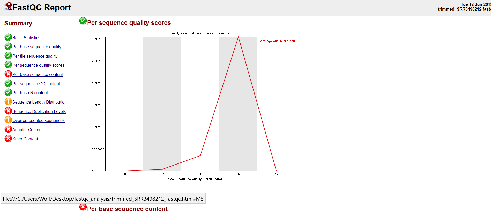
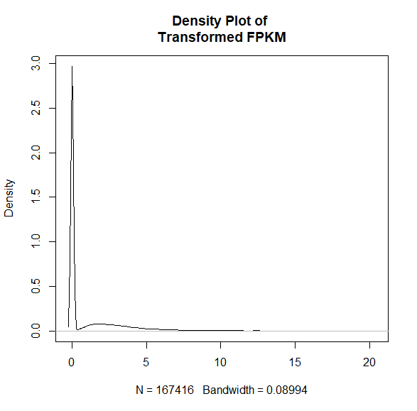
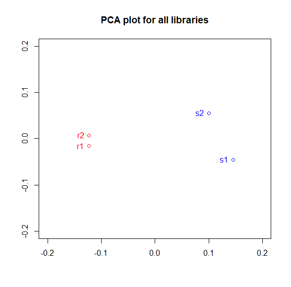
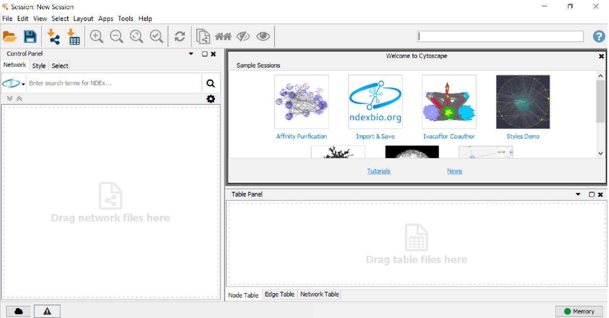
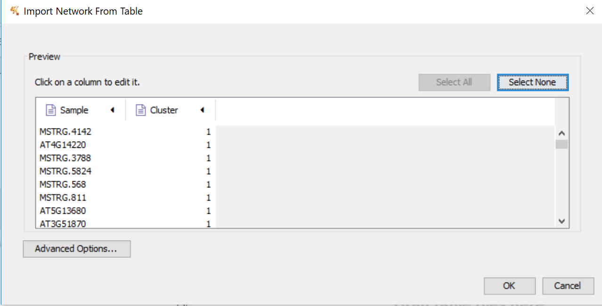
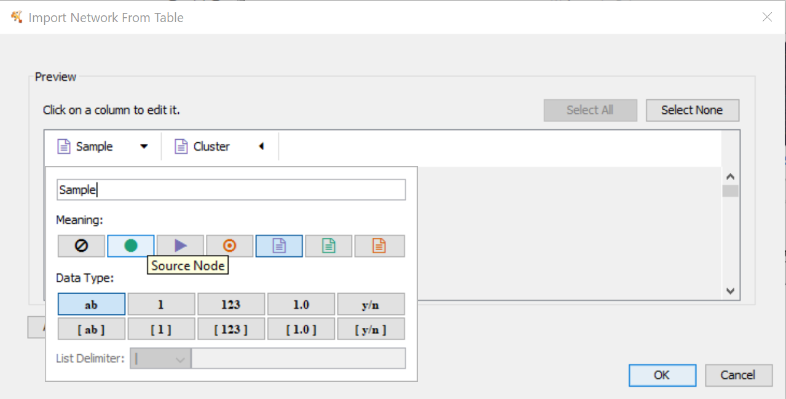

# RNA-Seq for Model Plant (Arabidopsis thaliana)

This repository is a usable, publicly available tutorial for analyzing differential expression data and creating topological gene networks. All steps have been provided for the UConn CBC Xanadu cluster here with appropriate headers for the Slurm scheduler that can be modified simply to run.  Commands should never be executed on the submit nodes of any HPC machine.  If working on the Xanadu cluster, you should use sbatch scriptname after modifying the script for each stage.  Basic editing of all scripts can be performed on the server with tools such as nano, vim, or emacs.  If you are new to Linux, please use <a href="https://bio Informatics.uconn.edu/unix-basics/">this</a> handy guide for the operating system commands.  In this guide, you will be working with common bio Informatic file formats, such as <a href="https://en.wikipedia.org/wiki/FASTA_format">FASTA</a>, <a href="https://en.wikipedia.org/wiki/FASTQ_format">FASTQ</a>, <a href="https://en.wikipedia.org/wiki/SAM_(file_format)">SAM/BAM</a>, and <a href="https://en.wikipedia.org/wiki/General_feature_format">GFF3/GTF</a>. You can learn even more about each file format <a href="https://bio Informatics.uconn.edu/resources-and-events/tutorials/file-formats-tutorial/">here</a>. If you do not have a Xanadu account and are an affiliate of UConn/UCHC, please apply for one <a href="https://bio Informatics.uconn.edu/contact-us/">here</a>.
	

Contents

<ul class="toc_list">
<li><a href="#First_Point_Header">1 Introduction and programs</>
<li><a href="#Second_Point_Header">2 Accessing the data using sra-toolkit</a></li>
<li><a href="#Third_Point_Header">3 Quality control using sickle</a></li>
<li><a href="#Fourth_Point_Header">4 Aligning reads to a genome using hisat2</a></li>
<li><a href="#Fifth_Point_Header">5 Transcript assembly and quantification with StringTie</a></li>
<li><a href="#Sixth_Point_Header">6 Differential expression analysis using ballgown</a></li>
<li><a href="#Seventh_Point_Header">7 Topological networking using cytoscape</a></li>
 <li><a href="#Eighth_Point_Header">8 Conclusion</a></li>
</ul>

<h2 id="First_Point_Header">Introduction and programs</h2>

In this tutorial, we will be analyzing thale cress (Arabidopsis thaliana) RNA-Seq data from various parts of the plant (roots, stems). Perhaps one of the most common organisms for genetic study, the aggregrate wealth of genetic  Information of the thale cress makes it ideal for new-comers to learn. Organisms such as this we call "model organisms". You may think of model organisms as a subset of living things which, under the normal conventions of analysis, behave nicely. The data we will be analyzing comes from an experiment in which various cellular RNA was collected from the roots and shoots of a single thale cress. The RNA profiles are archived in the SRA, and meta Information on each may be viewed through the SRA ID: <a href="https://www.ncbi.nlm.nih.gov/sra?term=SRX1756762">SRR3498212</a>, <a href="https://www.ncbi.nlm.nih.gov/sra/?term=SRR3498213">SRR3498213</a>, <a href="https://www.ncbi.nlm.nih.gov/sra?term=SRX1756765">SRR3498215</a>, <a href="https://www.ncbi.nlm.nih.gov/sra?term=SRX1756766">SRR3498216</a>.

The Single Read Archive, or SRA, is a publicly available database containing read sequences from a variety of experiments. Scientists who would like their read sequences present on the SRA submit a report containing the read sequences, experimental details, and any other accessory meta-data.

Our data, SRR3498212, SRR3498213, SRR3498215, SRR3498216 come from root 1, root 2, shoot 1, and shoot 2 of a single thale cress, respectively. Our objective in this analysis is to determine which genes are expressed in all samples, quantify the expression of each common gene in each sample, identify genes which are lowly expressed in roots 1 and 2 but highly expressed in shoots 1 and 2, or vice versa, quantify the relative expression of such genes, and lastly to create a visual topological network of genes with similar expression profiles.

You may connect to Xanadu via SSH, which will place you in your home directory

<pre style="color: silver; background: black;">-bash-4.2$ cd /home/CAM/$USER</pre> 

Your home directory contains 10TB of storage and will not pollute the capacities of other users on the cluster. 

The workflow may be cloned into the appropriate directory using the terminal command:
<pre style="color: silver; background: black;">-bash-4.2$ git clone https://github.com/wolf-adam-eily/rnaseq_for_model_plant.git
-bash-4.2$ cd rnaseq_for_model_plant
-bash-4.2$ ls
-bash-4.2$ cd rnaseq_for_model_plant/
-bash-4.2$ ls
<strong>all_clusters.csv.png           README.md
complete_edge_list.csv.png     Rplot.png
cytoscape1.png                 sam_sort_bam.sh
cytoscape2.png                 sickle_run.sh
cytoscape3.png                 transcript_assembly.sh
cytoscape4.png                 trimmed.html
cytoscape5.png                 trimmed_SRR3498212_fastqc.html
data_dump.sh                   trimmed_SRR3498213_fastqc.html
hisat2_run.sh                  trimmed_SRR3498215_fastqc.html
pcaplot_for_all_libraries.png  trimmed_SRR3498216_fastqc.html
quality_control.sh
</strong>
</pre>

All of the completed scripts for this tutorial are available for you to submit. However, before submitting, you may want to edit the scripts to include your email!

Before beginning, we need to understand a few aspects of the Xanadu server. When first logging into Xanadu from your local terminal, you will be connected to the submit node. The submit node is the interface with which users on Xanadu may <i>submit</i> their processes to the desired compute nodes, which will run the process. Never, under any circumstance, run processes directly in the submit node. Your process will be killed and all of your work lost! This tutorial will not teach you shell script configuration to submit your tasks on Xanadu. Therefore, before moving on, read and master the topics covered in the <a href="https://bio Informatics.uconn.edu/resources-and-events/tutorials/xanadu/">Xanadu tutorial</a>.

Now that we have covered the introduction and objective of our analysis, we may begin!

<h2 id="Second_Point_Header">Accessing the data using sra-toolkit </h2>

We know that the SRA contain the read sequences and accessory meta Information from experiments. Rather than downloading experimental data through a browser, we may use the <a href="https://www.ncbi.nlm.nih.gov/books/NBK158900/">sratoolkit</a>'s "fastq-dump" function to directly dump raw read data into the current terminal directory. Let's have a look at this function (it is expected that you have read the Xanadu tutorial, and are familiar with loading modules):

<pre style="color: silver; background: black;">-bash-4.2$ module load sratoolkit
  fastq-dump [options] <path> [<path>...]
  fastq-dump [options] <accession>

Use option --help for more  Information

fastq-dump : 2.8.2 </pre>

For our needs, we will simply be using the accession numbers to dump our experimental data into our directory. We know our accession numbers, so let's write a shell script to retrieve our raw reads. There are a variety of text editors available on Xanadu. My preferred text editor is "nano". Therefore, we will be using nano to write our shell script.

<pre style="color: silver; background: black;">-bash-4.2$ nano data_dump.sh

  GNU nano 2.3.1                                                      File: data_dump.sh                                                                                                                    

#!/bin/bash
#SBATCH --job-name=data_dump
#SBATCH --mail-user=your.email@uconn.edu
#SBATCH --mail-type=ALL
#SBATCH -n 1
#SBATCH -N 1
#SBATCH -c 16
#SBATCH --mem=120G
#SBATCH -o data_dump_%j.out
#SBATCH -e data_dump_%j.err
#SBATCH --partition=general

mkdir /home/CAM/$USER/tmp/
export TMPDIR=/home/CAM/$USER/tmp/

module load sratoolkit

fastq-dump SRR3498212
fastq-dump SRR3498213
fastq-dump SRR3498215
fastq-dump SRR3498216
                                                                                             [ Read 20 lines ]
^G Get Help                       ^O WriteOut                       ^R Read File                      ^Y Prev Page                      ^K Cut Text                       ^C Cur Pos
^X Exit                           ^J Justify                        ^W Where Is                       ^V Next Page                      ^U UnCut Text                     ^T To Spell
</pre>

As a precautionary measure, always include your temporary directory in the environment. While not all programs require a temporary directory to work, it takes far less time including ours in the environment than it is waiting for an error! After typing our script, we press CTRL + X to exit, 'y', and then enter to save.

Now that we have our script saved, we submit it to the compute nodes with the following command:

<pre style="color: silver; background: black;">-bash-4.2$ sbatch data_dump.sh</pre>

Now we wait until we receive an email that our process has finished.

Let's take a look at one of our files:

<pre style="color: silver; background: black;">-bash-4.2$ head SRR3498212.fastq
@SRR3498212.1 SN638:767:HC555BCXX:1:1108:2396:1996 length=50
NTCAATCGGTCAGAGCACCGCCCTGTCAAGGCGGAAGCAGATCGGAAGAG
+SRR3498212.1 SN638:767:HC555BCXX:1:1108:2396:1996 length=50
#&#60;DDDIIIIIIIIIIIIIIIIIIIIIIIIIIIIIIIIIIIIIIIIIIIII
@SRR3498212.2 SN638:767:HC555BCXX:1:1108:2934:1998 length=50
NCAGTTTTGACCAGATAGGTCTCGCTAAGAAGATTGAGAAGATCGGAAGA
+SRR3498212.2 SN638:767:HC555BCXX:1:1108:2934:1998 length=50
#&#60;&#60;&#60;BDFFEEHIIIHIHEHEHIIEHHHH?&#60;GCCCHCCGICHH1&#60;GHHHIC
@SRR3498212.3 SN638:767:HC555BCXX:1:1108:3860:2000 length=50
NTCGCTTCGTAAGCGAAAGGCCGCGAGTTCGAAGATCGGAAGAGCACACG
</pre>

We see that for our first three runs we have  Information about the sampled read including its length followed by the nucleotide read and then a "+" sign. The "+" sign marks the beginning of the corresponding scores for each nucleotide read for the nucleotide sequence preceding the "+" sign. 

<h2 id="Third_Point_Header">Quality control using sickle</h2>

Sickle performs quality control on illumina paired-end and single-end short read data using a sliding window. As the window slides along the fastq file, the average score of all the reads contained in the window is calculated. Should the average window score fall beneath a set threshold, <a href="https://github.com/najoshi/sickle/blob/master/README.md">sickle</a> determines the reads responsible and removes them from the run. After visiting the SRA pages for our data, we see that our data are single end reads. Let's find out what sickle can do with these:

<pre style="color: silver; background: black;">-bash-4.2$ module load sickle

-bash-4.2$ sickle

<strong>Usage</strong>: sickle <command> [options]

<strong>Command</strong>:
pe	paired-end sequence trimming
se	single-end sequence trimming

--help, display this help and exit
--version, output version  Information and exit</pre>

We have single-end sequences. 

<pre style="color: silver; background: black;">-bash-4.2$ sickle se

<strong>Usage</strong>: sickle se [options] -f <fastq sequence file> -t <quality type> -o <trimmed fastq file>

<strong>Options</strong>:
-f, --fastq-file, Input fastq file (required)
-t, --qual-type, Type of quality values (solexa (CASAVA < 1.3), illumina (CASAVA 1.3 to 1.7), sanger (which is CASAVA >= 1.8)) (required)
-o, --output-file, Output trimmed fastq file (required)
-q, --qual-threshold, Threshold for trimming based on average quality in a window. Default 20.
-l, --length-threshold, Threshold to keep a read based on length after trimming. Default 20.
-x, --no-fiveprime, Don't do five prime trimming.
-n, --trunc-n, Truncate sequences at position of first N.
-g, --gzip-output, Output gzipped files.
--quiet, Don't print out any trimming  Information
--help, display this help and exit
--version, output version  Information and exit</pre>

The quality may be any score from 0 to 40. The default of 20 is much too low for a robust analysis. We want to select only reads with a quality of 35 or better. Additionally, the desired length of each read is 50bp. Again, we see that a default of 20 is much too low for analysis confidence. We want to select only reads whose lengths exceed 45bp. Lastly, we must know the scoring type. While the quality type is not listed on the SRA pages, most SRA reads use the "sanger" quality type. Unless explicitly stated, try running sickle using the sanger qualities. If an error is returned, try illumina. If another error is returned, lastly try solexa.

Let's put all of this together for our sickle script using our downloaded fastq files:

<pre style="color: silver; background: black;">-bash-4.2$ nano sickle_run.sh

  GNU nano 2.3.1                                                      File: sickle_run.sh                                                                                                                   

#!/bin/bash
#SBATCH --job-name=sickle_run
#SBATCH --mail-user=
#SBATCH --mail-type=ALL
#SBATCH -n 1
#SBATCH -N 1
#SBATCH -c 16
#SBATCH --mem=120G
#SBATCH -o sickle_run_%j.out
#SBATCH -e sickle_run_%j.err
#SBATCH --partition=general

export TMPDIR=/home/CAM/$USER/tmp/

module load sickle

sickle se -f SRR3498212.fastq -t sanger -o trimmed_SRR3498212.fastq -q 35 -l 45

sickle se -f SRR3498213.fastq -t sanger -o trimmed_SRR3498213.fastq -q 35 -l 45

sickle se -f SRR3498215.fastq -t sanger -o trimmed_SRR3498215.fastq -q 35 -l 45

sickle se -f SRR3498216.fastq -t sanger -o trimmed_SRR3498216.fastq -q 35 -l 45

                                                                                             [ Read 23 lines ]
^G Get Help                       ^O WriteOut                       ^R Read File                      ^Y Prev Page                      ^K Cut Text                       ^C Cur Pos
^X Exit                           ^J Justify                        ^W Where Is                       ^V Next Page                      ^U UnCut Text                     ^T To Spell
</pre>
 
<pre style="color: silver; background: black;">-bash-4.2$ sbatch sickle_run.sh</pre>

It is helpful to see how the quality of the data has changed after using sickle. To do this, we will be using the commandline versions of <a href="https://www.bio Informatics.babraham.ac.uk/projects/fastqc/INSTALL.txt">fastqc</a> and <a href="http://multiqc. Info/docs/">MultiQC</a>. These two programs simply create reports of the average quality of our trimmed reads, with some graphs. There is no way to view a --help menu for these programs in the command-line. However, their use is quite simple, we simply run "fastqc <trimmed_fastq>" or "multiqc -f -n trimmed trimmed*". Do not worry too much about the options for MultiQC! Let's write our script:

<pre style="color: silver; background: black;">-bash-4.2$ nano quality_control.sh

  GNU nano 2.3.1                                                    File: quality_control.sh                                                                                                                

#!/bin/bash
#SBATCH --job-name=quality_control
#SBATCH --mail-user=
#SBATCH --mail-type=ALL
#SBATCH -n 1
#SBATCH -N 1
#SBATCH -c 16
#SBATCH --mem=120G
#SBATCH -o quality_control_%j.out
#SBATCH -e quality_control_%j.err
#SBATCH --partition=general

export TMPDIR=/home/CAM/$USER/tmp/

module load fastqc
module load MultiQC

fastqc trimmed_SRR3498212.fastq

fastqc trimmed_SRR3498213.fastq

fastqc trimmed_SRR3498215.fastq

fastqc trimmed_SRR3498216.fastq

multiqc -f -n trimmed trimmed*

                                                                                             [ Read 26 lines ]
^G Get Help                       ^O WriteOut                       ^R Read File                      ^Y Prev Page                      ^K Cut Text                       ^C Cur Pos
^X Exit                           ^J Justify                        ^W Where Is                       ^V Next Page                      ^U UnCut Text                     ^T To Spell
</pre>
 
<pre style="color: silver; background: black;">-bash-4.2$ sbatch quality_control.sh</pre>

fastqc will create the files "trimmed_file_fastqc.html". To have a look at one, we need to move all of our "trimmed_file_fastqc.html" files into a single directory, and then <a href="https://www.techrepublic.com/article/how-to-use-secure-copy-for-file-transfer/">secure copy</a> that folder to our local directory. Then, we may open our files! If that seems like too much work for you, you may open the files directly through this github. Simply click on any "html" file and you may view it in your browser immediately. Because of this, the steps mentioned above will not be placed in this tutorial.

This script will also create a directory "trimmed_data". Let's look inside of that directory:

<pre style="color: silver; background: black;">-bash-4.2$ cd trimmed_data<
-bash-4.2$ ls 
<strong>multiqc_fastqc.txt         multiqc.log
multiqc_general_stats.txt  multiqc_sources.txt
</strong></pre>

Let's have a look at the file format from fastqc and multiqc. When loading the fastqc file, you will be greeted with this screen:

There are some basic statistics which are all pretty self-explanatory. Notice that none of our sequences fail the quality report! It would be concerning if we had even one because this report is from our trimmed sequence! The same thinking applies to our sequence length. Should the minimum of the sequence length be below 45, we would know that sickle had not run properly. Let's look at the next index in the file:

This screen is simply a <a href="https://en.wikipedia.org/wiki/Box_plot">box-and-whiskers plot</a> of our quality scores per base pair. Note that there is a large variance and lower mean scores (but still about in our desired range) for base pairs 1-5. These are the primer sequences! I will leave it to you to ponder the behavior of this graph. If you're stumped, you may want to learn how <a href="https://www.illumina.com/techniques/sequencing.html">Illumina sequencing"</a> works.

Our next index is the per sequence quality scores:

This index is simply the total number of base pairs (y-axis) which have a given quality score (x-axis). This plot is discontinuous and discrete, and should you calculate the <a href="https://en.wikipedia.org/wiki/Riemann_sum">Riemann sum</a> the result is the total number of base pairs present across all reads.
	
The last index at which we are going to look is the "Overrepresented Sequences" index:

This is simply a list of sequences which appear disproportionately in our reads file. The reads file actually includes the primer sequences for this exact reason. When fastqc calculates a sequence which appears many times beyond the expected distribution, it may check the primer sequences in the reads file to determine if the sequence is a primer. If the sequence is not a primer, the result will be returned as "No Hit". Sequences which are returned as "No Hit" are most likely highly expressed genes.

We see that our multiqc file has the same indices as our fastqc files, but is simply the mean of all the statistics across our fastqc files:

<h2 id="Fourth_Point_Header">Aligning reads to a genome using hisat2</h2>
<a href="https://ccb.jhu.edu/software/hisat2/manual.shtml">HISAT2</a> is a fast and sensitive aligner for mapping next generation sequencing reads against a reference genome. HISAT2 requires two arguments: the reads file being mapped and the indexed genome to which those reads are mapped. Typically, the hisat2-build command is used to make a HISAT index file for the genome. It will create a set of files with the suffix .ht2, these files together build the index. What is an index and why is it helpful? Genome indexing is the same as indexing a tome, like an encyclopedia. It is much easier to locate  Information in the vastness of an encyclopedia when you consult the index, which is ordered in an easily navigatable way with pointers to the location of the  Information you seek within the encylopedia. Genome indexing is thus the structuring of a genome such that it is ordered in an easily navigatable way with pointers to where we can find whichever gene is being aligned. Let's have a look at how the hisat2-build command works:

<pre style="color: silver; background: black;">-bash-4.2$ module load hisat2
-bash-4.2$ hisat2-build

No input sequence or sequence file specified!
HISAT2 version 2.1.0 by Daehwan Kim ( Infphilo@gmail.com, http://www.ccb.jhu.edu/people/ Infphilo)
<strong>Usage</strong>: hisat2-build [options]* <reference_in> <ht2_index_base>
	reference_in            comma-separated list of files with ref sequences
	hisat2_index_base       write ht2 data to files with this dir/basename</strong></pre>

As you can see, we simply enter our reference genome files and the desired prefix for our .ht2 files. Now, fortunately for us, Xanadu has many indexed genomes which we may use. To see if there is a hisat2 <i>Arabidopsis thaliana</i> indexed genome we need to look at the <a href="https://bio Informatics.uconn.edu/databases/">Xanadu databases</a> page. We see that our desired indexed genome is in the location /isg/shared/databases/alignerIndex/plant/Arabidopsis/thaliana/Athaliana_HISAT2/. Now we are ready to align our reads using hisat2 (for hisat2, the script is going to be written first with an explanation of the options after).

<pre style="color: silver; background: black;">nano hisat2_run.sh

  GNU nano 2.3.1                                                      File: hisat2_run.sh                                                                                                                   

#!/bin/bash
#SBATCH --job-name=hisat2_run
#SBATCH --mail-user=
#SBATCH --mail-type=ALL
#SBATCH -n 1
#SBATCH -N 1
#SBATCH -c 16
#SBATCH --mem=120G
#SBATCH -o hisat2_run_%j.out
#SBATCH -e hisat2_run_%j.err
#SBATCH --partition=general

export TMPDIR=/home/CAM/$USER/tmp/

module load hisat2

hisat2 -p 16 --dta -x /isg/shared/databases/alignerIndex/plant/Arabidopsis/thaliana/Athaliana_HISAT2/thaliana -q trimmed_SRR3498212.fastq -S athaliana_root_1.sam

hisat2 -p 16 --dta -x /isg/shared/databases/alignerIndex/plant/Arabidopsis/thaliana/Athaliana_HISAT2/thaliana -q trimmed_SRR3498213.fastq -S athaliana_root_2.sam

hisat2 -p 16 --dta -x /isg/shared/databases/alignerIndex/plant/Arabidopsis/thaliana/Athaliana_HISAT2/thaliana -q trimmed_SRR3498215.fastq -S athaliana_shoot_1.sam

hisat2 -p 16 --dta -x /isg/shared/databases/alignerIndex/plant/Arabidopsis/thaliana/Athaliana_HISAT2/thaliana -q trimmed_SRR3498216.fastq -S athaliana_shoot_2.sam

                                                                                             [ Read 23 lines ]
^G Get Help                       ^O WriteOut                       ^R Read File                      ^Y Prev Page                      ^K Cut Text                       ^C Cur Pos
^X Exit                           ^J Justify                        ^W Where Is                       ^V Next Page                      ^U UnCut Text                     ^T To Spell
</pre>
 
<pre style="color: silver; background: black;">-p : number of processors been used
--dta: report alignments tailored for transcript assemblers
-x: path to index generated from previous step
-q: query input files in fastq format
-S: output SAM file</pre>
 
<pre style="color: silver; background: black;">bash-4.2$ sbatch hisat2_run.sh</pre>

Once the mapping have been completed, the file structure is as follows:
<pre style="color: silver; background: black;">bash-4.2$ ls
<strong>athaliana_root_1.sam
athaliana_root_2.sam
athaliana_shoot_1.sam
athaliana_shoot_2.sam</strong></pre>

When HISAT2 completes its run, it will summarize each of it’s alignments, and it is written to the standard error file, which can be found in the same folder once the run is completed.

<pre style="color: silver; background: black;">bash-4.2$ nano hisat2_run&#42;err

  GNU nano 2.3.1                                                   File: hisat2_run_507187.err                                                                                                              

34475799 reads; of these:
  34475799 (100.00%) were unpaired; of these:
    33017550 (95.77%) aligned 0 times
    1065637 (3.09%) aligned exactly 1 time
    392612 (1.14%) aligned >1 times
4.23% overall alignment rate
42033973 reads; of these:
  42033973 (100.00%) were unpaired; of these:
    40774230 (97.00%) aligned 0 times
    931377 (2.22%) aligned exactly 1 time
    328366 (0.78%) aligned >1 times
3.00% overall alignment rate
31671127 reads; of these:
  31671127 (100.00%) were unpaired; of these:
    31103167 (98.21%) aligned 0 times
    465131 (1.47%) aligned exactly 1 time
    102829 (0.32%) aligned >1 times
1.79% overall alignment rate
49890217 reads; of these:
  49890217 (100.00%) were unpaired; of these:
    48622480 (97.46%) aligned 0 times
    1029943 (2.06%) aligned exactly 1 time
    237794 (0.48%) aligned >1 times
2.54% overall alignment rate
</pre>
 
Let's have a look at a SAM file:

<pre style="color: silver; background: black;">-bash-4.2$ head -n 20 rnaseq_athaliana_root_1.sam
@HD	VN:1.0	SO:unsorted
@SQ	SN:Chr1	LN:30427671
@SQ	SN:Chr2	LN:19698289
@SQ	SN:Chr3	LN:23459830
@SQ	SN:Chr4	LN:18585056
@SQ	SN:Chr5	LN:26975502
@SQ	SN:ChrM	LN:366924
@SQ	SN:ChrC	LN:154478
@PG	ID:hisat2	PN:hisat2	VN:2.1.0	CL:"/isg/shared/apps/hisat2/2.1.0/hisat2-align-s --wrapper basic-0 -p 16 --dta -x /isg/shared/databases/alignerIndex/plant/Arabidopsis/thaliana/Athaliana_HISAT2/thaliana -q trimmed_SRR3498212.fastq -S rnaseq_athaliana_root_1.sam"
SRR3498212.6	4	*	0	0	*	*	0	0	TTTCCAAGCCCTTTCTAGTCTGCGCTTGAGTTTGATTGCAGAGATCGGAA	DDDDDIIIIIIIIIIIIIIIIIIIIIIIIIIIIIIIIIIIIIIIIIIIII	YT:Z:UU
SRR3498212.1	4	*	0	0	*	*	0	0	CAATCGGTCAGAGCACCGCCCTGTCAAGGCGGAAGCAGATCGGAAGAG	DDDIIIIIIIIIIIIIIIIIIIIIIIIIIIIIIIIIIIIIIIIIIIII	YT:Z:UU
SRR3498212.4	4	*	0	0	*	*	0	0	AAAGGGCGTGGGTTCAAATCCCACAGATGTCACCAGATCGGAAGAGC	DDHIIIIIIIIIEHHHIHIIIIHIIIIIIIIIIIIIIIIIIIIIIHH	YT:Z:UU
SRR3498212.8	4	*	0	0	*	*	0	0	TTAAGATTGCTGATTTTGGCCTGGCACGTGAGGTTAAGATCGGAAGAGCA	DDDDDIIIIIIIIIIIIIIIIIIIIIIIIIIIIIIIIIIIIIIIIIIIII	YT:Z:UU
SRR3498212.19	4	*	0	0	*	*	0	0	TGGATGATGGAAAAACCAGCAAGCCCCTCTTCTTTCAAGATCGGAAGAGC	DDDDDIIIIIIIIIIIIIIIIIIIIIIIIIIIIIIIIIIIIIIIIIIIII	YT:Z:UU
SRR3498212.23	4	*	0	0	*	*	0	0	TTTGCCTTCCAAGCAATAGACCCGGGTAGATCGGAAGAGCACACGTCTGA	DDDDDIIIIIIIIIIIIIIIIIIIIIIIIIIIIIIIIIIIIIIIIIIIII	YT:Z:UU
SRR3498212.24	4	*	0	0	*	*	0	0	TGAAACTTCTTGGTTTTAAAGTGTGAATATAGCTGACAAAAGATTGGAAG	DDDDDIIIIIIIIIIIIIIIIIIIHIIIIIIIIIIIIIIIIIIIIIIIII	YT:Z:UU
SRR3498212.12	4	*	0	0	*	*	0	0	AAGGGTGTTCTCTGCTACGGACCTCCAGATCGGAAGAGCACACGTCTGAA	DDDDDIIIIIIIIIIIIIIIIIIIIIIIIIIIIIIIIIIIIIIIIIIIII	YT:Z:UU
SRR3498212.27	4	*	0	0	*	*	0	0	ATTGTTCCGGGCTGCCCAGTCCAAGCTGAGAGTGAAGATCGGAAGAGCAC	DDDDDIIIIIIIIIIIIIIIIIIIIIIIIIIIIIIIIIIIIIIIIIIIII	YT:Z:UU
SRR3498212.29	4	*	0	0	*	*	0	0	TATGTCTACGCTGGTTCAAATCCAGCTCGGCCCACCAAGATCGGAAGAGC	DDDDDIIIIIIIIIHIIIIIIIIIIIIIIIIIIIIIIIIIIIIIIIIIII	YT:Z:UU
SRR3498212.18	4	*	0	0	*	*	0	0	CGTGGGTTCGACTCCCACTGTGGTCGCCAAGATCGGAAGAGCACACGTC	DDDCHCCHHHEIHIGIIIEGHHIIIIGHHHIIIIIIIIIIIIIIIIIII	YT:Z:UU
</pre>

All of the lines starting with an "@" symbol tell us something about the chromosomes or our input. For instance "@SQ SN:Chr1 LN:30427671" tells us that we have a sequence (@SQ) whose sequence name is Chr1 (SN:Chr1), lastly the sequence has a length of 30427671bp (LN:30427671). You may be wondering what the first line means. It is quite straightfoward! The first line is simply the header (@HD) stating that the file is unsorted (SO:unsorted). The second column in the first line is somewhat of a dummy variable, but stands for "version number". Lastly we have the "@PG" line, which, in order, keeps track of the software used to write the file (ID:hisat2), the program name used to align the reads (PN:hisat2), the version of the program used (VN:2.1.0), and lastly the user input which started the process (written in the form that the program reads, not in which we wrote it).

The alignment portion of the SAM file is much more straight-forward and may be understood by reading the SAM output formatting guide linked in the beginning of this tutorial.

Because of the density of the sam file, it is compressed to binary to create a more easily tractable file for manipulation by future programs. We convert the sam file to bam with the following command and sort it such that the alignments are listed in the order the genes appear in the genome. To do this we use the software <a href="https://en.wikipedia.org/wiki/SAMtools">samtools</a>:

<pre style="color: silver; background: black;">-bash-4.2$ module load samtools
bash-4.2$ samtools
<strong>Usage</strong>:   samtools <command> [options]

<strong>Commands</strong>:
  -- Indexing
     dict           create a sequence dictionary file
     faidx          index/extract FASTA
     index          index alignment

  -- Editing
     calmd          recalculate MD/NM tags and '=' bases
     fixmate        fix mate  Information
     reheader       replace BAM header
     targetcut      cut fosmid regions (for fosmid pool only)
     addreplacerg   adds or replaces RG tags
     markdup        mark duplicates

  -- File operations
     collate        shuffle and group alignments by name
     cat            concatenate BAMs
     merge          merge sorted alignments
     mpileup        multi-way pileup
     sort           sort alignment file
     split          splits a file by read group
     quickcheck     quickly check if SAM/BAM/CRAM file appears intact
     fastq          converts a BAM to a FASTQ
     fasta          converts a BAM to a FASTA

  -- Statistics
     bedcov         read depth per BED region
     depth          compute the depth
     flagstat       simple stats
     idxstats       BAM index stats
     phase          phase heterozygotes
     stats          generate stats (former bamcheck)

  -- Viewing
     flags          explain BAM flags
     tview          text alignment viewer
     view           SAM<->BAM<->CRAM conversion
     depad          convert padded BAM to unpadded BAM
</pre>

We are truly only interested in sorting our SAM files.

<pre style="color: silver; background: black;">-bash-4.2$ samtools sort

<strong>Usage</strong>: samtools sort [options...] [in.bam]
<strong>Options</strong>:
  -l INT     Set compression level, from 0 (uncompressed) to 9 (best)
  -m INT     Set maximum memory per thread; suffix K/M/G recognized [768M]
  -n         Sort by read name
  -t TAG     Sort by value of TAG. Uses position as secondary index (or read name if -n is set)
  -o FILE    Write final output to FILE rather than standard output
  -T PREFIX  Write temporary files to PREFIX.nnnn.bam
      --input-fmt-option OPT[=VAL]
               Specify a single input file format option in the form
               of OPTION or OPTION=VALUE
  -O, --output-fmt FORMAT[,OPT[=VAL]]...
               Specify output format (SAM, BAM, CRAM)
      --output-fmt-option OPT[=VAL]
               Specify a single output file format option in the form
               of OPTION or OPTION=VALUE
      --reference FILE
               Reference sequence FASTA FILE [null]
  -@, --threads INT
               Number of additional threads to use [0]
</pre>

The sort function converts SAM files to BAM automatically. Therefore, we can cut through most of these options and do a simple "samtools sort -o <output.bam> <inupt.sam>. Let's write our script:

<pre style="color: silver; background: black;">bash-4.2$ nano sam_sort_bam.sh

  GNU nano 2.3.1                                                     File: sam_sort_bam.sh                                                                                                                  

#!/bin/bash
#SBATCH --job-name=sam_sort_bam
#SBATCH --mail-user=
#SBATCH --mail-type=ALL
#SBATCH -n 1
#SBATCH -N 1
#SBATCH -c 16
#SBATCH --mem=120G
#SBATCH -o sam_sort_bam_%j.out
#SBATCH -e sam_sort_bam_%j.err
#SBATCH --partition=general

export TMPDIR=/home/CAM/$USER/tmp/

module load samtools

samtools sort -@ 16 -o athaliana_root_1.bam athaliana_root_1.sam

samtools sort -@ 16 -o athaliana_root_2.bam athaliana_root_2.sam

samtools sort -@ 16 -o athaliana_shoot_1.bam athaliana_shoot_1.sam

samtools sort -@ 16 -o athaliana_shoot_2.bam athaliana_shoot_2.sam
                                                                                             [ Read 23 lines ]
^G Get Help                       ^O WriteOut                       ^R Read File                      ^Y Prev Page                      ^K Cut Text                       ^C Cur Pos
^X Exit                           ^J Justify                        ^W Where Is                       ^V Next Page                      ^U UnCut Text                     ^T To Spell
</pre>

<pre style="color: silver; background: black;">bash-4.2$ sbatch sam_sort_bam.sh</pre>

<h2 id="Fifth_Point_Header">Transcript assembly and quantification with StringTie</h2>

This is the most intricate part of our analysis. Because of the many steps involved, this tutorial is going to walk through the steps before writing a final batch script to be submitted. 

Analysis of RNA-seq experiments requires accurate reconstructions of all the <a href="https://en.wikipedia.org/wiki/Gene_isoform">isoforms</a> expressed from each gene, as well as estimates of the relative abundance of those isoforms. Accurate quantification benefits from knowledge of precisely which reads originated from each isoform, which cannot be computed perfectly because reads are much shorter than transcripts. StringTie assembles transcripts from RNA-seq reads that have been aligned to the genome, first grouping the reads into distinct gene loci and then assembling each locus into as many isoforms as are needed to explain the data. To begin, it would be nice to have a source describing all genome features (simply a list of genes, exons, transcripts, etc., which states on which chromosome and over which base-pairs those genes are). The file format for which we're looking is GFF (which is exactly as described the sentence prior). We can download the GFF file for the thale cress with the following code:
  
<pre style="color: silver; background: black;">bash-4.2$ wget https://www.arabidopsis.org/download_files/Genes/TAIR10_genome_release/TAIR10_gff3/TAIR10_GFF3_genes.gff

bash-4.2$ head TAIR_GFF3_genes.gff
Chr1	TAIR10	chromosome	1	30427671	.	.	.	ID=Chr1;Name=Chr1
Chr1	TAIR10	gene	3631	5899	.	+	.	ID=AT1G01010;Note=protein_coding_gene;Name=AT1G01010
Chr1	TAIR10	mRNA	3631	5899	.	+	.	ID=AT1G01010.1;Parent=AT1G01010;Name=AT1G01010.1;Index=1
Chr1	TAIR10	protein	3760	5630	.	+	.	ID=AT1G01010.1-Protein;Name=AT1G01010.1;Derives_from=AT1G01010.1
Chr1	TAIR10	exon	3631	3913	.	+	.	Parent=AT1G01010.1
Chr1	TAIR10	five_prime_UTR	3631	3759	.	+	.	Parent=AT1G01010.1
Chr1	TAIR10	CDS	3760	3913	.	+	0	Parent=AT1G01010.1,AT1G01010.1-Protein;
Chr1	TAIR10	exon	3996	4276	.	+	.	Parent=AT1G01010.1
Chr1	TAIR10	CDS	3996	4276	.	+	2	Parent=AT1G01010.1,AT1G01010.1-Protein;
Chr1	TAIR10	exon	4486	4605	.	+	.	Parent=AT1G01010.1
</pre>

The GFF file is quite self-explanatory. However, it'd be nice if could combine all of the pieces of  Information from the GFF into something better. For instance, if there are multiple overlapping, but distinct exons from a single gene, we could use that  Information to determine the isoforms of that gene. Then, we could make a file which gives each isoform its own track (there are other extrapolations to be made, but this is our most relevant example). Luckily for us, we can use the program "gffread" to transform our GFF file into the more useful form just stated, The output of <a href="https://github.com/gpertea/gffread">gffread --help</a> is much too dense for us to go into here, but the necessary options will be explained. Do not run this code! We are compiling this code with various other chunks into one script, be patient!

<pre style="color: silver; background: black;">bash-4.2$ module load gffread
gffread TAIR10_GFF3_genes.gff -T -o athaliana_TAIR10_genes.gtf</pre>

The option -T tells gffread to convert our input into the gtf format, and the option -o simply is how we call the output. The GTF format is simply the transcript assembly file, and is composed of exons and coding sequences. Let's have a look at the GTF file:

<pre style="color: silver; background: black;">-bash-4.2$ head athaliana_TAIR10_genes.gtf 
Chr1	TAIR10	exon	3631	3913	.	+	.	transcript_id "AT1G01010.1"; gene_id "AT1G01010"; gene_name "AT1G01010";
Chr1	TAIR10	exon	3996	4276	.	+	.	transcript_id "AT1G01010.1"; gene_id "AT1G01010"; gene_name "AT1G01010";
Chr1	TAIR10	exon	4486	4605	.	+	.	transcript_id "AT1G01010.1"; gene_id "AT1G01010"; gene_name "AT1G01010";
Chr1	TAIR10	exon	4706	5095	.	+	.	transcript_id "AT1G01010.1"; gene_id "AT1G01010"; gene_name "AT1G01010";
Chr1	TAIR10	exon	5174	5326	.	+	.	transcript_id "AT1G01010.1"; gene_id "AT1G01010"; gene_name "AT1G01010";
Chr1	TAIR10	exon	5439	5899	.	+	.	transcript_id "AT1G01010.1"; gene_id "AT1G01010"; gene_name "AT1G01010";
Chr1	TAIR10	CDS	3760	3913	.	+	0	transcript_id "AT1G01010.1"; gene_id "AT1G01010"; gene_name "AT1G01010";
Chr1	TAIR10	CDS	3996	4276	.	+	2	transcript_id "AT1G01010.1"; gene_id "AT1G01010"; gene_name "AT1G01010";
Chr1	TAIR10	CDS	4486	4605	.	+	0	transcript_id "AT1G01010.1"; gene_id "AT1G01010"; gene_name "AT1G01010";
Chr1	TAIR10	CDS	4706	5095	.	+	0	transcript_id "AT1G01010.1"; gene_id "AT1G01010"; gene_name "AT1G01010";

-bash-4.2$ tail athaliana_TAIR10_genes.gtf 
ChrM	TAIR10	exon	349830	351413	.	-	.	transcript_id "ATMG01360.1"; gene_id "ATMG01360"; gene_name "ATMG01360";
ChrM	TAIR10	CDS	349830	351413	.	-	0	transcript_id "ATMG01360.1"; gene_id "ATMG01360"; gene_name "ATMG01360";
ChrM	TAIR10	exon	360717	361052	.	-	.	transcript_id "ATMG01370.1"; gene_id "ATMG01370"; gene_name "ATMG01370";
ChrM	TAIR10	CDS	360717	361052	.	-	0	transcript_id "ATMG01370.1"; gene_id "ATMG01370"; gene_name "ATMG01370";
ChrM	TAIR10	exon	361062	361179	.	-	.	transcript_id "ATMG01380.1"; gene_id "ATMG01380"; gene_name "ATMG01380";
ChrM	TAIR10	exon	361350	363284	.	-	.	transcript_id "ATMG01390.1"; gene_id "ATMG01390"; gene_name "ATMG01390";
ChrM	TAIR10	exon	363725	364042	.	+	.	transcript_id "ATMG01400.1"; gene_id "ATMG01400"; gene_name "ATMG01400";
ChrM	TAIR10	CDS	363725	364042	.	+	0	transcript_id "ATMG01400.1"; gene_id "ATMG01400"; gene_name "ATMG01400";
ChrM	TAIR10	exon	366086	366700	.	-	.	transcript_id "ATMG01410.1"; gene_id "ATMG01410"; gene_name "ATMG01410";
ChrM	TAIR10	CDS	366086	366700	.	-	0	transcript_id "ATMG01410.1"; gene_id "ATMG01410"; gene_name "ATMG01410";
</pre>

We see that whereas in our GFF file we have various untranslated regions included, as well as annotations, the GTF format contains  Information only on various transcripts for each gene. The "transcript_id" denoter in the last column tells us the gene and its isoform, and everything else about the GTF file is quite apparent!

Just as was stated for our conversion from gff to gtf, it would be helpful for us to perform the same operation on our aligned reads. That is, if there are multiple, overlapping but distinct reads from a single gene, we could combine these reads into one transcript isoform. Because we have the gene isoforms in the gtf file, we can re-map each assembled transcript to a gene isoform and then count how many mappings there are per isoform. This, in effect, allows us to quantify the expression rates of each isoform. We will be using the program <a href="http://ccb.jhu.edu/software/stringtie/index.shtml?t=manual">StringTie</a> to assemble the transcripts for each sample. StringTie requires three input arguments: the BAM alignment file, the genomic GTF file, and the desired output GTF filename. Thus, our code will look like (do not run this!):

<pre style="color: silver; background: black;">bash-4.2$ module load stringtie

stringtie -p 16 athaliana_root_1.bam -G athaliana_TAIR10_genes.gtf -o athaliana_root_1.gtf

stringtie -p 16 athaliana_root_2.bam -G athaliana_TAIR10_genes.gtf -o athaliana_root_2.gtf

stringtie -p 16 athaliana_shoot_1.bam -G athaliana_TAIR10_genes.gtf -o athaliana_shoot_1.gtf

stringtie -p 16 athaliana_shoot_2.bam -G athaliana_TAIR10_genes.gtf -o athaliana_shoot_2.gtf</pre>

Let's have a look at the stringtie output:

<pre style="color: silver; background: black;">-bash-4.2$ athaliana_root_1.gtf
&#35; stringtie -p 16 rnaseq_athaliana_root_1.bam -G athaliana_TAIR10_genes.gtf -o rnaseq_athaliana_root_1.gtf
&#35; StringTie version 1.3.3b
Chr1	StringTie	transcript	28500	28706	1000	+	.	gene_id "STRG.1"; transcript_id "STRG.1.1"; reference_id "AT1G01046.1"; ref_gene_id "AT1G01046"; ref_gene_name "AT1G01046"; cov "0.241546"; FPKM "3.727008"; TPM "0.747930";
Chr1	StringTie	exon	28500	28706	1000	+	.	gene_id "STRG.1"; transcript_id "STRG.1.1"; exon_number "1"; reference_id "AT1G01046.1"; ref_gene_id "AT1G01046"; ref_gene_name "AT1G01046"; cov "0.241546";
Chr1	StringTie	transcript	47494	48839	1000	-	.	gene_id "STRG.2"; transcript_id "STRG.2.1"; cov "3.928230"; FPKM "60.611832"; TPM "12.163484";
Chr1	StringTie	exon	47494	47982	1000	-	.	gene_id "STRG.2"; transcript_id "STRG.2.1"; exon_number "1"; cov "4.529652";
Chr1	StringTie	exon	48075	48839	1000	-	.	gene_id "STRG.2"; transcript_id "STRG.2.1"; exon_number "2"; cov "3.543791";
Chr1	StringTie	transcript	50075	51199	1000	-	.	gene_id "STRG.3"; transcript_id "STRG.3.1"; reference_id "AT1G01100.2"; ref_gene_id "AT1G01100"; ref_gene_name "AT1G01100"; cov "8.437494"; FPKM "130.188904"; TPM "26.126097";
Chr1	StringTie	exon	50075	50337	1000	-	.	gene_id "STRG.3"; transcript_id "STRG.3.1"; exon_number "1"; reference_id "AT1G01100.2"; ref_gene_id "AT1G01100"; ref_gene_name "AT1G01100"; cov "6.228601";
Chr1	StringTie	exon	50419	50631	1000	-	.	gene_id "STRG.3"; transcript_id "STRG.3.1"; exon_number "2"; reference_id "AT1G01100.2"; ref_gene_id "AT1G01100"; ref_gene_name "AT1G01100"; cov "9.487524";
</pre>

While this is certainly confusing, we can still understand it. To start each row we have the chromosome for each sequence. The second column is the software used to assemble the transcript, in our case StringTie. The third column is the sequence type, either a transcript or an exon. The next two columns are the start and end bp of the feature (assuming the chromosome starts at bp 1), followed by another column which is the score. The column after the score is either "+" or "-" for forward strand and reverse strand, respectively. Our last two columns are the frame ("." means frame not determined) and the feature meta Information. 

You may be wondering about the last three columns which are not standard in GTF. The column "cov" is simply the covariance of the gene across samples (if the gene is highly or lowly expressed in both samples the covariance will be high, if it is highly expressed in one sample and lowly expressed in another sample, the covariance will be low). The FPKM column is the fragment per kilobase million value. Simply put, this is the number of times the specific feature was counted divided by how many counts there were for all features combined, in millions. That number is then divided by the length of the feature in kilobases. The reason for this being that longer features should have higher counts. For instance, when we split our mRNA in sequences of 50 or less for reading, one 5000 bp transcript will appear as 100 counts, and one 500 bp transcript will appear as 10 counts. Now, let's divide each count by the transcript length in kilobases: we have 20 as the value for the 5000 bp sequence (100/(5000/1000)) and 20 as the value for the 500 bp sequence (10/(500/1000)! Now our quantification matches the actual expression profile -- that is, both features were transcribed the same amount.

The last column, TPM, is the transcripts per feature per  million transcripts counted across all features combined. As evident from the example above, without some sort of scaling factor, this value is highly misleading.

The assembled isoforms in each sample are most likely different from those of other samples. However, we may repeat the process of determining isoforms but this time using the gtf files for all four samples. That is, if there are isoforms across the sample gtfs which overlap but are distinct, we may merge those into a single isoform. To do this we will be using the --merge option of stringtie. The --merge option of stringtie requires three input arguments: the genomic GTF file, the desired output filename, and a plain-text file containing each file to be merged separated by a return. To begin, let's make our plain-text file:

<pre style="color: silver; background: black;">bash-4.2$ nano mergelist.txt

  GNU nano 2.3.1                                                      File: mergelist.txt                                                                                                                   

athaliana_root_1.gtf
athaliana_root_2.gtf
athaliana_shoot_1.gtf
athaliana_shoot_2.gtf
                                                                                              [ Read 4 lines ]
^G Get Help                       ^O WriteOut                       ^R Read File                      ^Y Prev Page                      ^K Cut Text                       ^C Cur Pos
^X Exit                           ^J Justify                        ^W Where Is                       ^V Next Page                      ^U UnCut Text                     ^T To Spell

</pre>

After saving our plain-text file, we can merge our samples using the following code (do not run this!):

<pre style="color: silver; background: black;">bash-4.2$ module load stringtie
stringtie --merge -p 16 -G -o merged stringtie_merged.gtf</pre>

While the options are quite self-explanatory, one thing to note is that the "-o" option is simply the output <i>prefix</i>. After running, you should see the following files in your directory (but hopefully you listened and did not run it yet!):

<pre style="color: silver; background: black;">bash-4.2$ ls
merged.annotated.gtf
merged.loci
merged.stats
merged.stringtie_merged.gtf.refmap
merged.stringtie_merged.gtf.tmap
merged.tracking</pre>

Although you have not run the code yet, let's have a look at some of the files we've generated (we will not be looking at the merged.annotated.gtf as we are already quite familiar with the gtf format!)

<pre style="color: silver; background: black;">-bash-4.2$ head merged.loci
XLOC_000001	Chr1[+]3631-5899	AT1G01010|AT1G01010.1	AT1G01010.1
XLOC_000002	Chr1[+]23146-31227	AT1G01040|AT1G01040.1,AT1G01040|AT1G01040.2	AT1G01040.1,AT1G01040.2
XLOC_000003	Chr1[+]28500-28706	AT1G01046|AT1G01046.1	AT1G01046.1
XLOC_000004	Chr1[+]44677-44787	AT1G01073|AT1G01073.1	AT1G01073.1
XLOC_000005	Chr1[+]52239-54692	AT1G01110|AT1G01110.2,AT1G01110|AT1G01110.1	AT1G01110.2,AT1G01110.1
XLOC_000006	Chr1[+]56624-56740	AT1G01115|AT1G01115.1	AT1G01115.1
XLOC_000007	Chr1[+]72339-74096	AT1G01160|AT1G01160.1,AT1G01160|AT1G01160.2	AT1G01160.1,AT1G01160.2
XLOC_000008	Chr1[+]75583-76758	AT1G01180|AT1G01180.1	AT1G01180.1
XLOC_000009	Chr1[+]88898-89745	AT1G01210|AT1G01210.1	AT1G01210.1
XLOC_000010	Chr1[+]91376-95651	AT1G01220|AT1G01220.1	AT1G01220.1</pre>

We see we have a condensed form of our various exons. The exon loci name is the first column, followed by the chromosome, strand, and bp location in the second column. The final columns are the gene ID, the transcript IDs to which the loci belong, and the isoforms to which the transcripts belong.

<pre style="color: silver; background: black;">-bash-4.2$ nano merged.stats

  GNU nano 2.3.1                                                      File: merged.stats                                                                                                                    

&#35; gffcompare v0.10.4 | Command line was:
&#35; gffcompare -r athaliana_TAIR10_genes.gtf -G -o merged stringtie_merged.gtf
&#35;

&#35; Summary for dataset: stringtie_merged.gtf
&#35;     Query mRNAs :   41854 in   33403 loci  (30272 multi-exon transcripts)
&#35;            (6013 multi-transcript loci, ~1.3 transcripts per locus)
&#35; Reference mRNAs :   41607 in   33350 loci  (30127 multi-exon)
&#35; Super-loci w/ reference transcripts:    33184
&#35;-----------------| Sensitivity | Precision  |
        Base level:   100.0     |    99.9    |
        Exon level:   100.0     |    99.9    |
      Intron level:   100.0     |   100.0    |
Intron chain level:   100.0     |    99.5    |
  Transcript level:   100.0     |    99.4    |
       Locus level:   100.0     |    99.8    |

     Matching intron chains:   30127
       Matching transcripts:   41607
              Matching loci:   33350

          Missed exons:       0/169264  (  0.0%)
           Novel exons:      90/169578  (  0.1%)
        Missed introns:       0/127896  (  0.0%)
         Novel introns:      13/127951  (  0.0%)
           Missed loci:       0/33350   (  0.0%)
            Novel loci:      75/33403   (  0.2%)

 Total union super-loci across all input datasets: 33403
41854 out of 41854 consensus transcripts written in merged.annotated.gtf (0 discarded as redundant)

                                                                                             [ Read 30 lines ]
^G Get Help                       ^O WriteOut                       ^R Read File                      ^Y Prev Page                      ^K Cut Text                       ^C Cur Pos
^X Exit                           ^J Justify                        ^W Where Is                       ^V Next Page                      ^U UnCut Text                     ^T To Spell
</pre>

The  Information here is quite apparent.

<pre style="color: silver; background: black;">-bash-4.2$ head merged.stringtie_merged.gtf.refmap
ref_gene_id	ref_id	class_code	qry_id_list
AT1G01010	AT1G01010.1	=	AT1G01010|AT1G01010.1
AT1G01040	AT1G01040.1	=	AT1G01040|AT1G01040.1
AT1G01040	AT1G01040.2	=	AT1G01040|AT1G01040.2
AT1G01046	AT1G01046.1	=	AT1G01046|AT1G01046.1
AT1G01073	AT1G01073.1	=	AT1G01073|AT1G01073.1
AT1G01110	AT1G01110.2	=	AT1G01110|AT1G01110.2
AT1G01110	AT1G01110.1	=	AT1G01110|AT1G01110.1
AT1G01115	AT1G01115.1	=	AT1G01115|AT1G01115.1
AT1G01160	AT1G01160.1	=	AT1G01160|AT1G01160.1
</pre>

Here we have the gene IDs from the reference GFF, followed by the isoform IDs from the reference GTF, the "class_code" which simply tells you that the last column was matched fully ("=") or partially ("c"). Taking our first column, we see that all of isoform ATG01010.1 was matched to the gene ATG01010.

<pre style="color: silver; background: black;">-bash-4.2$ head merged.stringtie_merged.gtf.tmap
ref_gene_id	ref_id	class_code	qry_gene_id	qry_id	num_exons	FPKM	TPM		cov	len	major_iso_id	ref_match_len
AT1G01090	AT1G01090.1	=	AT1G01090	AT1G01090.1	3	0.000000	0.000000	0.000000	1627	AT1G01090.1	1627
AT1G01100	AT1G01100.2	=	AT1G01100	AT1G01100.2	4	0.000000	0.000000	0.000000	631	AT1G01100.2	631
AT1G01100	AT1G01100.1	=	AT1G01100	AT1G01100.1	4	0.000000	0.000000	0.000000	587	AT1G01100.2	587
AT1G01100	AT1G01100.4	=	AT1G01100	AT1G01100.4	4	0.000000	0.000000	0.000000	607	AT1G01100.2	607
AT1G01100	AT1G01100.3	=	AT1G01100	AT1G01100.3	5	0.000000	0.000000	0.000000	566	AT1G01100.2	566
AT1G01120	AT1G01120.1	=	AT1G01120	AT1G01120.1	1	0.000000	0.000000	0.000000	1899	AT1G01120.1	1899
AT1G01180	AT1G01180.1	=	AT1G01180	AT1G01180.1	1	0.000000	0.000000	0.000000	1176	AT1G01180.1	1176
AT1G01183	AT1G01183.1	=	AT1G01183	AT1G01183.1	1	0.000000	0.000000	0.000000	101	AT1G01183.1	101
AT1G01225	AT1G01225.1	=	AT1G01225	AT1G01225.1	2	0.000000	0.000000	0.000000	1025	AT1G01225.1	1025
</pre>

All of the  Information in the .tmap file may be readily understood now, knowing that "len" and "ref_match_len" are the sequence lengths and reference lengths, respectively.

Lastly,
<pre style="color: silver; background: black;">-bash-4.2$ head merged.tracking
TCONS_00000001	XLOC_000001	AT1G01010|AT1G01010.1	=	q1:AT1G01010|AT1G01010.1|6|0.000000|0.000000|0.000000|1688
TCONS_00000002	XLOC_000002	AT1G01040|AT1G01040.1	=	q1:AT1G01040|AT1G01040.1|20|0.000000|0.000000|0.000000|6251
TCONS_00000003	XLOC_000002	AT1G01040|AT1G01040.2	=	q1:AT1G01040|AT1G01040.2|20|0.000000|0.000000|0.000000|5877
TCONS_00000004	XLOC_000003	AT1G01046|AT1G01046.1	=	q1:AT1G01046|AT1G01046.1|1|0.000000|0.000000|0.000000|207
TCONS_00000005	XLOC_000004	AT1G01073|AT1G01073.1	=	q1:AT1G01073|AT1G01073.1|1|0.000000|0.000000|0.000000|111
TCONS_00000006	XLOC_000005	AT1G01110|AT1G01110.2	=	q1:AT1G01110|AT1G01110.2|5|0.000000|0.000000|0.000000|1782
TCONS_00000007	XLOC_000005	AT1G01110|AT1G01110.1	=	q1:AT1G01110|AT1G01110.1|3|0.000000|0.000000|0.000000|1439
TCONS_00000008	XLOC_000006	AT1G01115|AT1G01115.1	=	q1:AT1G01115|AT1G01115.1|1|0.000000|0.000000|0.000000|117
TCONS_00000009	XLOC_000007	AT1G01160|AT1G01160.1	=	q1:AT1G01160|AT1G01160.1|5|0.000000|0.000000|0.000000|1045
TCONS_00000010	XLOC_000007	AT1G01160|AT1G01160.2	=	q1:AT1G01160|AT1G01160.2|6|0.000000|0.000000|0.000000|1129
</pre>

the merged.tracking is the compact form of tmap file combined with the loci file. The last column has the gene, gene isoform, number of hits, FPKM, TPM, cov, and length all in that order.

Our last step is to create a count-table for the differential expression software "ballgown". A word of note about ballgown, ballgown requires that all of the files it will analyze be in their own parent directory, "ballgown", and furthermore each file is in its own subdirectory "ballgown/file_sub/file". Knowing we have four files, let's create the required structure for ballgown (run this):

<pre style="color: silver; background: black;">-bash-4.2$ mkdir ballgown
-bash-4.2$ cd ballgown
-bash-4.2$ mkdir athaliana_root_1
-bash-4.2$ mkdir athaliana_root_2
-bash-4.2$ mkdir athaliana_shoot_1
-bash-4.2$ mkdir athaliana_shoot_2
-bash-4.2$ cd -</pre>

The reason for this will become obvious soon. Now we will use StringTie to make our count tables (do not run this!):

<pre style="color: silver; background: black;">-bash-4.2$ module load stringtie

stringtie -e -B -p 16 athaliana_root_1.bam -G stringtie_merged.gtf -o ballgown/athaliana_root_1/athaliana_root_1.count

stringtie -e -B -p 16 athaliana_root_2.bam -G stringtie_merged.gtf -o ballgown/athaliana_root_2/athaliana_root_2.count

stringtie -e -B -p 16 athaliana_shoot_1.bam -G stringtie_merged.gtf -o ballgown/athaliana_shoot_1/athaliana_shoot_1.count

stringtie -e -B -p 16 athaliana_shoot_2.bam -G stringtie_merged.gtf -o ballgown/athaliana_shoot_2/athaliana_shoot_2.count
</pre>

Now we are ready to compile all of our code into a single script:

<pre style="color: silver; background: black;">-bash-4.2$ nano transcript_assembly.sh

 GNU nano 2.3.1                                                   File: transcript_assembly.sh                                                                                                             

#!/bin/bash
#SBATCH --job-name=sam_sort_bam
#SBATCH --mail-user=
#SBATCH --mail-type=ALL
#SBATCH -n 1
#SBATCH -N 1
#SBATCH -c 16
#SBATCH --mem=120G
#SBATCH -o sam_sort_bam_%j.out
#SBATCH -e sam_sort_bam_%j.err
#SBATCH --partition=general

export TMPDIR=/home/CAM/$USER/tmp/

module load gffread
module load stringtie

gffread TAIR10_GFF3_genes.gff -T -o athaliana_TAIR10_genes.gtf

stringtie -p 16 athaliana_root_1.bam -G athaliana_TAIR10_genes.gtf -o athaliana_root_1.gtf

stringtie -p 16 athaliana_root_2.bam -G athaliana_TAIR10_genes.gtf -o athaliana_root_2.gtf

stringtie -p 16 athaliana_shoot_1.bam -G athaliana_TAIR10_genes.gtf -o athaliana_shoot_1.gtf

stringtie -p 16 athaliana_shoot_2.bam -G athaliana_TAIR10_genes.gtf -o athaliana_shoot_2.gtf

stringtie --merge -p 16 -G -o merged stringtie_merged.gtf

stringtie -e -B -p 16 athaliana_root_1.bam -G stringtie_merged.gtf -o ballgown/athaliana_root_1/athaliana_root_1.count

stringtie -e -B -p 16 athaliana_root_2.bam -G stringtie_merged.gtf -o ballgown/athaliana_root_2/athaliana_root_2.count

stringtie -e -B -p 16 athaliana_shoot_1.bam -G stringtie_merged.gtf -o ballgown/athaliana_shoot_1/athaliana_shoot_1.count

stringtie -e -B -p 16 athaliana_shoot_2.bam -G stringtie_merged.gtf -o ballgown/athaliana_shoot_2/athaliana_shoot_2.count

                                                                                             [ Read 36 lines ]
^G Get Help                       ^O WriteOut                       ^R Read File                      ^Y Prev Page                      ^K Cut Text                       ^C Cur Pos
^X Exit                           ^J Justify                        ^W Where Is                       ^V Next Page                      ^U UnCut Text                     ^T To Spell
</pre>
 
<pre style="color: silver; background: black;">-bash-4.2$ sbatch transcript_assembly.sh</pre>

<h2 id="Sixth_Point_Header">Differential expression analysis using ballgown</h2>
For many organisms, many of the same genes are expressed in separate cell types, with a variety of phenotype differences a result of the specific isoforms a cell will use. Therefore, when performing a differential expression analysis from different parts of one organism (not one species, but a singular organism), it is wise to perform an isoform expression analysis alongside a standard differential expression analysis and combine the results (as we are doing here). We will only be performing the isoform expresion analysis. <a href="https://bioconductor.org/packages/release/bioc/html/ballgown.html">Ballgown</a> is a differential expression package for R via Bioconductor ideal for isoform expression analyses. Before beginning, you need to secure copy our ballgown directory from Xanadu to your local machine:

<pre style="color: silver; background: black;">-bash-4.2$ exit
logout
Connection to xanadu-submit-ext.cam.uchc.edu closed.
user:~$ scp -r YOUR.USER.NAME@xanadu-submit-ext.cam.uchc.edu:/home/CAM/$USER/rnaseq_for_model_plant/ballgown .</pre>

Now we load <a href="https://www.rstudio.com/products/rstudio/download/">RStudio</a> with administrator privileges (otherwise you cannot install packages!).

To begin we must download and load the proper packages:

<pre style="color: silver; background: black;">install.packages("devtools")
install.packages("RFLPtools")
source("http://www.bioconductor.org/biocLite.R")
biocLite(c("alyssafrazee/RSkittleBrewer","ballgown", "genefilter", "dplyr", "devtools"))

library(ballgown)
library(RSkittleBrewer)
library(genefilter)
library(dplyr)
library(ggplot2)
library(gplots)
library(devtools)
library(RFLPtools)</pre>

Now we need to set our working directory to the directory which contains our "ballgown" folder. For me, this is:

<pre style="color: silver; background: black;">dir <- "C://Users/Wolf/Desktop/"
setwd(dir)
list.files()</pre>

You should see the "ballgown" folder after the list.files() command.

Let's have a look at the ballgown function:

<pre style="color: silver; background: black;">help("ballgown")

<strong>constructor function for ballgown objects</strong>

<strong>Description</strong>

<em>constructor function for ballgown objects</em>

<strong>Usage</strong>

ballgown(samples = NULL, dataDir = NULL, samplePattern = NULL,
  bamfiles = NULL, pData = NULL, verbose = TRUE, meas = "all")
Arguments

samples			vector of file paths to folders containing sample-specific ballgown data (generated by tablemaker). If samples 
			is provided, dataDir and samplePattern are not used.
dataDir			file path to top-level directory containing sample-specific folders with ballgown data in them. Only used if 
			samples is NULL.
samplePattern		regular expression identifying the subdirectories of\ dataDir containing data to be loaded into the ballgown 
			object (and only those subdirectories). Only used if samples is NULL.
bamfiles		optional vector of file paths to read alignment files for each sample. If provided, make sure to sort properly
			(e.g., in the same order as samples). Default NULL.
pData			optional data.frame with rows corresponding to samples and columns corresponding to phenotypic variables.
verbose			if TRUE, print status messages and timing  Information as the object is constructed.
meas			character vector containing either "all" or one or more of: "rcount", "ucount", "mrcount", "cov", "cov_sd", 
			"mcov", "mcov_sd", or "FPKM". The resulting ballgown object will only contain the specified expression 	
			measurements, for the appropriate features. See vignette for which expression measurements are available for 
			which features. "all" creates the full object.</pre>

Because of the structure of our ballgown directory, we may use dataDir = "ballgown", samplePattern = "athaliana", measure = "FPKM", and pData = some_type_of_phenotype_matrix.

We want all of the objects in our arguments to be in the same order as they are present in the ballgown directory. Therefore, we want our pData matrix to have two columns -- the first column being the samples as they appear in the ballgown directory, and the second being the phenotype of each sample in the column before it (root or shoot). Let's see the order of our sample files:

<pre style="color: silver; background: black;">list.files("ballgown/")
<strong>[1] "athaliana_root_1"  "athaliana_root_2"  "athaliana_shoot_1" "athaliana_shoot_2"</strong></pre>

Now we construct a 4x2 phenotype matrix with the first column being our samples in order and the second each sample's phenotype:

<pre style="color: silver; background: black;">pheno_data = c("athaliana_root_1", "athaliana_root_2", "athaliana_shoot_1",  "athaliana_shoot_2","root","root","shoot","shoot")</pre>

R fills the rows of each column first. Therefore, our character vector contains all of column 1 in order, followed by all of column 2 in order. The end result will be our matrix.

<pre style="color: silver; background: black;">
pheno_matrix = matrix(pheno_data, ncol=2)

pheno_matrix = as.data.frame(pheno_matrix)

colnames(pheno_matrix) <- c("sample", "part")

rownames(pheno_matrix) <- pheno_matrix[,1]

pheno_matrix
<strong>                             sample  part
athaliana_root_1   athaliana_root_1  root
athaliana_root_2   athaliana_root_2  root
athaliana_shoot_1 athaliana_shoot_1 shoot
athaliana_shoot_2 athaliana_shoot_2 shoot</strong></pre>

We may now create our ballgown object:

<pre style="color: silver; background: black;">
bg <- ballgown(dataDir = "ballgown", pData=pheno_matrix, samplePattern = "athaliana")
<strong>Wed Jun 13 11:12:33 2018
Wed Jun 13 11:12:33 2018: Reading linking tables
Wed Jun 13 11:12:33 2018: Reading intron data files
Wed Jun 13 11:12:35 2018: Merging intron data
Wed Jun 13 11:12:36 2018: Reading exon data files
Wed Jun 13 11:12:39 2018: Merging exon data
Wed Jun 13 11:12:40 2018: Reading transcript data files
Wed Jun 13 11:12:41 2018: Merging transcript data
Wrapping up the results
Wed Jun 13 11:12:42 2018</strong>
</pre>
We filter our ballgown object to take only genes with <a href="https://en.wikipedia.org/wiki/Variance">variances</a> above 1 
using <a href="https://www.rdocumentation.org/packages/metaMA/versions/3.1.2/topics/rowVars">rowVars()</a>.

<pre style="color: silver; background: black;">??ballgown::subset</pre>

<pre>
<strong style="color: blue;">subset ballgown objects to specific samples or genomic locations</strong>

<strong style="color: grey;">Description</strong>

<em style="color: green;">subset ballgown objects to specific samples or genomic locations</em>

<strong style="color: grey;">Usage</strong>

subset(x, ...)

## S4 method for signature 'ballgown'
subset(x, cond, genomesubset = TRUE)

<strong style="color: grey;">Arguments</strong>

x	
a 		ballgown object
...		further arguments to generic subset
cond		Condition on which to subset. See details.
genomesubset	if TRUE, subset x to a specific part of the genome. Otherwise, subset x to only include specific samples. TRUE by 
		default.

<strong style="color: grey;">Details</strong>

To use subset, you must provide the cond argument as a string representing a logical expression specifying your desired subset. The subset expression can either involve column names of texpr(x, "all") (if genomesubset is TRUE) or of pData(x) (if genomesubset is FALSE). For example, if you wanted a ballgown object for only chromosome 22, you might call subset(x, "chr == 'chr22'"). (Be sure to handle quotes within character strings appropriately).</pre>

 

<pre style="color: silver; background: black;">bg_filt = subset(bg, "rowVars(texpr(bg))>1", genomesubset=TRUE)</pre>

We follow the guide and subset our ballgown object under the condition that the row-variances of the expression data are greater than one, keeping the gene names.</pre>

To perform the isoform differential expression analysis we use ballgown's "stattest" function. Let's have a look at it:
<pre style="color: silver; background: black;">??ballgown::stattest</pre>

<pre><strong style="color: blue;">statistical tests for differential expression in ballgown</strong>

<strong style="color: grey;">Description</strong>

<em style="color: green;">Test each transcript, gene, exon, or intron in a ballgown object for differential expression, using
comparisons of linear models.</em>

<strong style="color: grey;">Usage</strong>

stattest(gown = NULL, gowntable = NULL, pData = NULL, mod = NULL,
  mod0 = NULL, feature = c("gene", "exon", "intron", "transcript"),
  meas = c("cov", "FPKM", "rcount", "ucount", "mrcount", "mcov"),
  timecourse = FALSE, covariate = NULL, adjustvars = NULL, gexpr = NULL,
  df = 4, getFC = FALSE, libadjust = NULL, log = TRUE)

<strong style="color: grey;">Arguments</strong>

gown		name of an object of class ballgown
gowntable	matrix or matrix-like object with rownames representing feature IDs and columns representing samples, with expression 
		estimates in the cells. Provide the feature name with feature. You must provide exactly one of gown or gowntable. NB:
		gowntable is log-transformed within stattest if log is TRUE, so provide un-logged expression values in gowntable.
pData		Required if gowntable is provided: data frame giving phenotype data for the samples in the columns of gowntable. (Rows
		of pData correspond to columns of gowntable). If gown is used instead, it must have a non-null, valid pData slot (and 
		the pData argument to stattest should be left NULL).
mod		object of class model.matrix representing the design matrix for the linear regression model including covariates of
		interest
mod0		object of class model.matrix representing the design matrix for the linear regression model without the covariates of 
		interest.
feature		the type of genomic feature to be tested for differential expression. If gown is used, must be one of "gene", 
		"transcript", "exon", or "intron". If gowntable is used, this is just used for labeling and can be whatever the rows of
		gowntable represent.
meas		the expression measurement to use for statistical tests. Must be one of "cov", "FPKM", "rcount", "ucount", "mrcount",
		or "mcov". Not all expression measurements are available for all features. Leave as default if gowntable is provided.
timecourse	if TRUE, tests whether or not the expression profiles of genomic features vary over time (or another continuous
		covariate) in the study. Default FALSE. Natural splines are used to fit time profiles, so you must have more timepoints
		than degrees of freedom used to fit the splines. The default df is 4.
covariate	string representing the name of the covariate of interest for the differential expression tests. Must correspond to the
		name of a column of pData(gown). If timecourse=TRUE, this should be the study's time variable.
adjustvars	optional vector of strings representing the names of potential confounders. Must correspond to names of columns of
		pData(gown).
gexpr		optional data frame that is the result of calling gexpr(gown)). (You can speed this function up by pre-creating
		gexpr(gown).)
df		degrees of freedom used for modeling expression over time with natural cubic splines. Default 4. Only used if 
		timecourse=TRUE.
getFC		if TRUE, also return estimated fold changes (adjusted for library size and confounders) between populations. Only
		available for 2-group comparisons at the moment. Default FALSE.
libadjust	library-size adjustment to use in linear models. By default, the adjustment is defined as the sum of the sample's log
		expression measurements below the 75th percentile of those measurements. To use a different library-size adjustment,
		provide a numeric vector of each sample's adjustment value. Entries of this vector correspond to samples in in rows of
		pData. If no library size adjustment is desired, set to FALSE.
log		if TRUE, outcome variable in linear models is log(expression+1), otherwise it's expression. Default TRUE.
</pre>

We see we can determine which transcripts and genes are differentially expressed in the roots or shoots, alongside the fold changes of
each differentially expressed gene as measured in FPKM with the following code:

<pre style="color: silver; background: black;">results_transcripts = stattest(bg_filt, feature="transcript" , covariate = "part" , 
getFC = TRUE, meas = "FPKM")

results_genes = stattest(bg_filt, feature="gene" , covariate = "part" , getFC = TRUE, meas = "FPKM")</pre>

Let's take a look at this object:

<pre style="color: silver; background: black;">head(results_genes)
<strong>  feature         id           fc         pval      qval
1    gene MSTRG.4142 2.075827e-01 0.0000491845 0.5184498
2    gene  AT4G14220 2.103846e+01 0.0001882308 0.5184498
3    gene MSTRG.3788 5.031936e-03 0.0002087393 0.5184498
4    gene MSTRG.5824 2.867578e-03 0.0002187155 0.5184498
5    gene  MSTRG.568 3.186395e-01 0.0002764999 0.5184498
6    gene  MSTRG.811 3.236509e-04 0.0003448702 0.5184498</strong></pre>

Each differentially expressed gene (or isoform) is listed, alongside its ID, fold-change (percent increase), <a href="https://en.wikipedia.org/wiki/P-value">p-value</a>, and <a href="http://www.statisticshowto.com/q-value/">q-value</a>.

Now we want to order our results according to their p-value, and then subset to only take results with p-values below 0.01, writing our findings to a csv:

<pre style="color: silver; background: black;">
results_genes = arrange(results_genes,pval)
results_genes = subset(results_genes, pval < 0.01)
results_transcripts = arrange(results_transcripts, pval)
results_transcripts = subset(results_transcripts, pval < 0.01)
write.csv(results_transcripts, "transcript_results.csv", row.names=FALSE)
write.csv(results_genes, "results_genes.csv", row.names=FALSE)

&#35;&#35;we use row.names=FALSE because currently the row names are just the numbers 1, 2, 3. . .
</pre>

We should take advantage while we have this results_genes object and annotate the genes we have deemed significant (p-values below 0.01, every gene now in this object). To annotate the genes we will be using <a href="https://www.bioconductor.org/packages/devel/bioc/html/biomaRt.html">biomaRt</a> and biomartr. You can install these with the following code:
<pre style="color: silver; background: black;">
## try http:// if https:// URLs are not supported
source("https://bioconductor.org/biocLite.R")
biocLite("biomaRt")
install.packages("biomartr")</pre>

The first step in annotating our genes of interest is to choose our database. We do this using the "useMart" function of biomaRt:
<pre style="color: silver; background: black;">library(biomaRt)
library(biomartr)
??biomaRt::useMart

useMart {biomaRt}	R Documentation
Connects to the selected BioMart database and dataset

<strong>Description</strong>

<em>A first step in using the biomaRt package is to select a BioMart database and dataset to use. The useMart function enables one to connect to a specified BioMart database and dataset within this database. To know which BioMart databases are available see the listMarts function. To know which datasets are available within a BioMart database, first select the BioMart database using useMart and then use the listDatasets function on the selected BioMart, see listDatasets function.</em>

<strong>Usage</strong>

useMart(biomart, dataset, host="www.ensembl.org",
path="/biomart/martservice", port=80, archive=FALSE, ssl.verifypeer =
TRUE, ensemblRedirect = NULL, version, verbose = FALSE)
<strong>Arguments</strong>

biomart		BioMart database name you want to connect to. Possible database names can be retrieved with the functio listMarts
dataset		Dataset you want to use. To see the different datasets available within a biomaRt you can e.g. do: mart = 
		useMart('ensembl'), followed by listDatasets(mart).
host		Host to connect to. Defaults to www.ensembl.org
path		Path that should be pasted after to host to get access to the web service URL
port		port to connect to, will be pasted between host and path 
archive		Boolean to indicate if you want to access archived versions of BioMart databases. Note that this argument is now 
		deprecated and will be removed in the future. A better alternative is to leave archive = FALSE and to specify the url 
		of the archived BioMart you want to access. For Ensembl you can view the list of archives using listEnsemblArchives
ssl.verifypeer	Set SSL peer verification on or off. By default ssl.verifypeer is set to TRUE
ensemblRedirect	This argument has now been deprecated.
version		Use version name instead of biomart name to specify which BioMart you want to use
verbose		Give detailed output of what the method is doing while in use, for debugging</pre>

A quick google search will show that the genome we used, TAIR10, is the Ensembl format of the thale cress. We are going to want to use the gene dataset. Let's verify that it is there following the instructions provided:
<pre style="color: silver; background: black;">mart = useMart("ensembl")
 head(listDatasets(mart))
<strong>                      dataset                        description      version
1  acarolinensis_gene_ensembl     Anole lizard genes (AnoCar2.0)    AnoCar2.0
2   amelanoleuca_gene_ensembl              Panda genes (ailMel1)      ailMel1
3     amexicanus_gene_ensembl        Cave fish genes (AstMex102)    AstMex102
4     anancymaae_gene_ensembl Ma's night monkey genes (Anan_2.0)     Anan_2.0
5 aplatyrhynchos_gene_ensembl          Duck genes (BGI_duck_1.0) BGI_duck_1.0
6        btaurus_gene_ensembl                 Cow genes (UMD3.1)       UMD3.1</strong></pre>

We want to scan this for the thale cress. But first, let's make sure we can scan it, period:

<pre style="color: silver; background: black;">listDatasets(mart)[grep("thaliana",listDatasets(mart)[,1]),]
<strong>                    dataset           description version
2 amelanoleuca_gene_ensembl Panda genes (ailMel1) ailMel1</strong></pre>

We subset the listDatasets(mart) dataframe to include all rows which have the substring "amelanoleuca" in them. The return is row 2, which we can easily verify matches the head of the dataframe. Now let's try it with our species, "thaliana":
<pre style="color: silver; background: black;">listDatasets(mart)[grep("thaliana",listDatasets(mart)[,1]),]
<strong>[1] dataset     description version    
<0 rows> (or 0-length row.names)</strong></pre>

There is no match. The reason for this is that biomaRt defaults to animal model organisms! We need to access the plant database. Now let's try:
<pre style="color: silver; background: black;">listMarts(host="plants.ensembl.org")
<strong>            biomart                      version
1       plants_mart      Ensembl Plants Genes 39
2 plants_variations Ensembl Plants Variations 39</strong>

##if you are confused by the use of the listMarts function, read the useMart guide above!

mart = useMart("plants_mart", host="plants.ensembl.org")
head(listDatasets(mart))
<strong>              dataset                             description          version
1     alyrata_eg_gene        Arabidopsis lyrata genes (v.1.0)            v.1.0
2   atauschii_eg_gene    Aegilops tauschii genes (ASM34733v1)       ASM34733v1
3   athaliana_eg_gene     Arabidopsis thaliana genes (TAIR10)           TAIR10
4 atrichopoda_eg_gene    Amborella trichopoda genes (AMTR1.0)          AMTR1.0
5 bdistachyon_eg_gene    Brachypodium distachyon genes (v1.0)             v1.0
6      bnapus_eg_gene Brassica napus genes (AST_PRJEB5043_v1) AST_PRJEB5043_v1</strong>

##we see the thale cress as row 3! now we may choose our dataset:

thale_cress_mart = useMart("plants_mart",host="plants.ensembl.org",dataset="athaliana_eg_gene")
head(thale_cress_mart)
<strong>Error in x[seq_len(n)] : object of type 'S4' is not subsettable</strong></pre>

Our mart is in the <a href="http://adv-r.had.co.nz/S4.html">S4</a> class and not readable right now. We can process it by using the "getBM" function:
<pre style="color: silver; background: black;">??biomaRt::getBM

Retrieves  Information from the BioMart database

<strong>Description</strong>

<em>This function is the main biomaRt query function. Given a set of filters and corresponding values, it retrieves the user specified attributes from the BioMart database one is connected to.</em>

<strong>Usage</strong>

getBM(attributes, filters = "", values = "", mart, curl = NULL, 
checkFilters = TRUE, verbose = FALSE, uniqueRows = TRUE, bmHeader = FALSE,
quote = "\"")
<strong>Arguments</strong>

attributes	Attributes you want to retrieve. A possible list of attributes can be retrieved using the function listAttributes.
filters		Filters (one or more) that should be used in the query. A possible list of filters can be retrieved using the function 
		listFilters.
values		Values of the filter, e.g. vector of affy IDs. If multiple filters are specified then the argument should be a list of 
		vectors of which the position of each vector corresponds to the position of the filters in the filters argument.
mart		object of class Mart, created with the useMart function.
curl		An optional 'CURLHandle' object, that can be used to speed up getBM when used in a loop.
checkFilters	Sometimes attributes where a value needs to be specified, for example upstream\_flank with value 20 for obtaining 
		upstream sequence flank regions of length 20bp, are treated as filters in BioMarts. To enable such a query to work, one 
		must specify the attribute as a filter and set checkFilters = FALSE for the query to work.
verbose		When using biomaRt in webservice mode and setting verbose to TRUE, the XML query to the webservice will be printed.
uniqueRows	If the result of a query contains multiple identical rows, setting this argument to TRUE (default) will result in 
		deleting the duplicated rows in the query result at the server side.
bmHeader	Boolean to indicate if the result retrieved from the BioMart server should include the data headers or not, defaults to 
		FALSE. This should only be switched on if the default behavior results in errors, setting to on might still be able to 
		retrieve your data in that case
quote		Sometimes parsing of the results fails due to errors in the Ensembl data fields such as containing a quote, in such 
		cases you can try to change the value of quote to try to still parse the results.

<strong>Value</strong>

A data.frame. There is no implicit mapping between its rows and the function arguments (e.g. filters, values), therefore make sure to have the relevant identifier(s) returned by specifying them in attributes. See Examples.</pre>

Let's find out the attributes and filters by following the instructions in the vignette:
<pre style="color: silver; background: black;">dim(listAttributes(thale_cress_mart))
<strong>[1] 1118    3</strong>

##1118 attributes is too many for us to look through. They are ordered somewhat in prevalence of use.

##let's look at the most commonly used attributes and see if they'll work for us

head(listAttributes(thale_cress_mart))
<strong>                   name              description         page
1       ensembl_gene_id           Gene stable ID feature_page
2 ensembl_transcript_id     Transcript stable ID feature_page
3    ensembl_peptide_id        Protein stable ID feature_page
4       ensembl_exon_id           Exon stable ID feature_page
5           description         Gene description feature_page
6       chromosome_name Chromosome/scaffold name feature_page</strong>

##we don't know the chromosome name, so we can just take attributes 1,3, and 5

thale_cress_data_frame = getBM(attributes=c("ensembl_gene_id","ensembl_peptide_id","description"),mart=thale_cress_mart)
head(thale_cress_data_frame)
<strong>
  ensembl_gene_id ensembl_peptide_id                              description
1       AT3G11415                                                            
2       AT1G31258                       other RNA [Source:TAIR;Acc:AT1G31258]
3       AT5G24735                       other RNA [Source:TAIR;Acc:AT5G24735]
4       AT2G45780                       other RNA [Source:TAIR;Acc:AT2G45780]
5       AT2G42425                    Unknown gene [Source:TAIR;Acc:AT2G42425]
6       AT4G01533                       other RNA [Source:TAIR;Acc:AT4G01533]</pre></strong>

The default descriptions are certainly underwhelming. Let's see if there are any other types of descriptions we can get:

<pre style="color: silver; background: black;">listAttributes(thale_cress_mart)[grep("descr",listAttributes(thale_cress_mart)[,1]),]
<strong>                           name                description         page
5                   description           Gene description feature_page
34       goslim_goa_description     GOSlim GOA Description feature_page
115  interpro_short_description Interpro Short Description feature_page
116        interpro_description       Interpro Description feature_page
153                 description           Gene description    structure
180                 description           Gene description     homologs
1039                description           Gene description          snp
1042         source_description Variant source description          snp
1080                description           Gene description    sequences</strong></pre>

Using the other descriptions will take much, much longer as the  Information is extracted from the appropriate databases via internet connection. For this tutorial we will be sticking with our un-impressive descriptions. However, you may choose the description best for you and your resesarch. Before we move on to annotating, let's have a look at the filters:

<pre style="color: silver; background: black;">head(listFilters(thale_cress_mart))
<strong>                name                            description
1    chromosome_name               Chromosome/scaffold name
2              start                                  Start
3                end                                    End
4             strand                                 Strand
5 chromosomal_region e.g. 1:100:10000:-1, 1:100000:200000:1
6        with_chembl                      With ChEMBL ID(s)</strong></pre>

Should we only want to annotate genes from a specific chromosome or any other critera, we would use the "filter" argument in getBM to select only the subset of the genome we desire. We now have all of the pieces required for us to annotate our results. Let's have a look at our gene results object and our thale cress data frame one more time:
<pre style="color: silver; background: black;">head(thale_cress_data_frame)
<strong>  ensembl_gene_id ensembl_peptide_id                              description
1       AT3G11415                                                            
2       AT1G31258                       other RNA [Source:TAIR;Acc:AT1G31258]
3       AT5G24735                       other RNA [Source:TAIR;Acc:AT5G24735]
4       AT2G45780                       other RNA [Source:TAIR;Acc:AT2G45780]
5       AT2G42425                    Unknown gene [Source:TAIR;Acc:AT2G42425]
6       AT4G01533                       other RNA [Source:TAIR;Acc:AT4G01533]</strong>

head(results_genes)
<strong> feature         id           fc         pval      qval
1    gene MSTRG.4142 2.075827e-01 0.0000491845 0.5184498
2    gene  AT4G14220 2.103846e+01 0.0001882308 0.5184498
3    gene MSTRG.3788 5.031936e-03 0.0002087393 0.5184498
4    gene MSTRG.5824 2.867578e-03 0.0002187155 0.5184498
5    gene  MSTRG.568 3.186395e-01 0.0002764999 0.5184498
6    gene  MSTRG.811 3.236509e-04 0.0003448702 0.5184498</strong></pre>

Funny enough, we do not actually use a biomaRt function to annotate our genes! We can simply subset the thale cress data frame to consist of only rows whose ensemble_gene_id matches our results_genes id. Let's give it a try:
<pre style="color: silver; background: black;">annotated_genes = subset(thale_cress_data_frame, ensembl_gene_id %in% results_genes$id)
head(annotated_genes)
<strong>     ensembl_gene_id ensembl_peptide_id                                            description
340        AT2G07754                                      pre-tRNA [Source:TAIR;Acc:AT2G07754]
5348       AT1G79830        AT1G79830.1 Golgin Putative 5 [Source:UniProtKB/TrEMBL;Acc:F4HQB9]
5349       AT1G79830        AT1G79830.3 Golgin Putative 5 [Source:UniProtKB/TrEMBL;Acc:F4HQB9]
5350       AT1G79830        AT1G79830.2 Golgin Putative 5 [Source:UniProtKB/TrEMBL;Acc:F4HQB9]
5351       AT1G79830        AT1G79830.4 Golgin Putative 5 [Source:UniProtKB/TrEMBL;Acc:F4HQB9]
5352       AT1G79830        AT1G79830.5 Golgin Putative 5 [Source:UniProtKB/TrEMBL;Acc:F4HQB9]</strong>

##let's check our dimensions to ensure every gene was annotated

dim(results_genes)
<strong>[1] 216   5</strong>

dim(annotated_genes)
<strong>[1] 233   3</strong>

##our dimensions do not match! Let's investigate:

head(annotated_genes)
<strong>     ensembl_gene_id ensembl_peptide_id                                            description
340        AT2G07754                                      pre-tRNA [Source:TAIR;Acc:AT2G07754]
5348       AT1G79830        AT1G79830.1 Golgin Putative 5 [Source:UniProtKB/TrEMBL;Acc:F4HQB9]
5349       AT1G79830        AT1G79830.3 Golgin Putative 5 [Source:UniProtKB/TrEMBL;Acc:F4HQB9]
5350       AT1G79830        AT1G79830.2 Golgin Putative 5 [Source:UniProtKB/TrEMBL;Acc:F4HQB9]
5351       AT1G79830        AT1G79830.4 Golgin Putative 5 [Source:UniProtKB/TrEMBL;Acc:F4HQB9]
5352       AT1G79830        AT1G79830.5 Golgin Putative 5 [Source:UniProtKB/TrEMBL;Acc:F4HQB9]</strong>

tail(annotated_genes)
<strong>      ensembl_gene_id ensembl_peptide_id
52741       AT1G52400        AT1G52400.1
52742       AT1G52400        AT1G52400.2
52861       AT5G10110        AT5G10110.1
53166       AT1G63360        AT1G63360.2
53167       AT1G63360        AT1G63360.1
53521       AT3G51870        AT3G51870.1
                                                                                            description
52741         Beta-D-glucopyranosyl abscisate beta-glucosidase [Source:UniProtKB/Swiss-Prot;Acc:Q9SE50]
52742         Beta-D-glucopyranosyl abscisate beta-glucosidase [Source:UniProtKB/Swiss-Prot;Acc:Q9SE50]
52861                     DNA-directed RNA polymerase subunit beta [Source:UniProtKB/TrEMBL;Acc:Q8VZV8]
53166            Probable disease resistance protein At1g63360 [Source:UniProtKB/Swiss-Prot;Acc:Q9SH22]
53167            Probable disease resistance protein At1g63360 [Source:UniProtKB/Swiss-Prot;Acc:Q9SH22]
53521 Probable envelope ADP,ATP carrier protein, chloroplastic [Source:UniProtKB/Swiss-Prot;Acc:O65023]</strong></pre>

A-ha. We see the mismatch in dimension length is due to some genes having different isoforms and therefore different peptide ids. Because we matched our data frames by gene id, some of the genes we have extracted multiple peptides! Also, take notice of this:

<pre style="color: silver; background: black;">annotated_genes$ensembl_gene_id
<strong>  [1] "AT2G07754" "AT1G79830" "AT1G79830" "AT1G79830" "AT1G79830" "AT1G79830" "AT3G01340" "AT3G01340"
  [9] "AT5G16110" "AT5G42680" "AT5G42680" "AT4G38160" "AT4G38160" "AT4G38160" "AT4G38160" "AT1G49380"
 [17] "AT4G24290" "AT4G24290" "AT4G24290" "AT4G25320" "AT2G22430" "AT4G14220" "AT2G17760" "AT3G20290"
 [25] "AT3G20290" "AT3G20290" "AT2G29360" "AT1G74560" "AT1G74560" "AT4G09150" "AT4G09150" "AT5G49840"
 [33] "AT5G49840" "AT5G49840" "AT5G49840" "AT1G29990" "AT5G65660" "AT1G70000" "AT1G70000" "AT4G18780"
 [41] "AT5G47490" "AT5G47490" "AT5G47490" "AT1G54080" "AT1G54080" "AT3G43740" "AT3G43740" "AT4G26900"
 [49] "AT5G53470" "AT1G61800" "AT1G61800" "AT5G27330" "AT3G20890" "AT3G20890" "AT5G10020" "AT5G10020"
 [57] "AT5G54830" "AT3G17430" "AT3G17430" "AT2G43970" "AT2G43970" "AT4G25960" "AT4G30990" "AT4G30990"
 [65] "AT4G30990" "AT1G60010" "AT5G45350" "AT5G45350" "AT5G45350" "AT5G45350" "AT5G45350" "AT5G45350"
 [73] "AT5G45350" "AT5G04510" "AT5G04510" "AT5G04510" "AT3G25430" "AT3G25430" "AT1G32210" "AT1G32210"
 [81] "AT3G58140" "AT5G58540" "AT5G58540" "AT5G58540" "AT2G22230" "AT3G46280" "AT5G45410" "AT5G45410"
 [89] "AT5G45410" "AT5G45410" "AT5G45410" "AT4G16695" "AT4G16695" "AT4G16695" "AT4G16695" "AT4G16695"
 [97] "AT1G20190" "AT1G20190" "AT1G23760" "AT5G09660" "AT5G09660" "AT5G09660" "AT5G09660" "AT5G09660"
[105] "AT4G32760" "AT4G32760" "AT4G32760" "AT4G21460" "AT4G21460" "AT3G51740" "AT3G62930" "AT4G30080"
[113] "AT2G41440" "AT2G41440" "AT2G41440" "AT2G41440" "AT1G06700" "AT1G06700" "AT1G06700" "AT4G06676"
[121] "AT4G06676" "AT1G54920" "AT1G54920" "AT1G54920" "AT1G54920" "AT1G51710" "AT1G51710" "AT5G55790"
[129] "AT5G55790" "AT5G55790" "AT5G03670" "AT5G03670" "AT5G48380" "AT3G32930" "AT3G32930" "AT5G18480"
[137] "AT3G47290" "AT3G47290" "AT1G32100" "AT5G08420" "AT2G17530" "AT2G17530" "AT2G17530" "AT4G34000"
[145] "AT4G34000" "AT4G34000" "AT4G34000" "AT3G48860" "AT3G48860" "AT3G48860" "AT5G18670" "AT1G65730"
[153] "AT1G63770" "AT1G63770" "AT1G63770" "AT1G63770" "AT1G63770" "AT1G63770" "AT1G63770" "AT2G39890"
[161] "AT2G39890" "AT2G39890" "AT4G10120" "AT4G10120" "AT4G10120" "AT4G10120" "AT4G10120" "AT4G36750"
[169] "AT2G20670" "AT2G42620" "AT2G01735" "AT2G01735" "AT2G26340" "AT2G26340" "AT1G27020" "AT5G13680"
[177] "AT3G27320" "AT3G27320" "AT1G24880" "AT1G24880" "AT5G62920" "AT4G17650" "AT1G64330" "AT5G63380"
[185] "AT5G39670" "AT4G08510" "AT4G08510" "AT2G41960" "AT3G11030" "AT4G30100" "AT4G30100" "AT5G56290"
[193] "AT3G57220" "AT3G09560" "AT3G09560" "AT3G09560" "AT3G09560" "AT5G57710" "AT5G25540" "AT5G25540"
[201] "AT5G25540" "AT1G03080" "AT1G03080" "AT1G03080" "AT5G35690" "AT3G53510" "AT5G10240" "AT5G10240"
[209] "AT5G16800" "AT5G16800" "AT5G16800" "AT5G13370" "AT1G01440" "AT5G16390" "AT5G16390" "AT5G63940"
[217] "AT2G46520" "AT1G26740" "AT5G15570" "AT3G51150" "AT3G51150" "AT3G51150" "AT3G51150" "AT3G51150"
[225] "AT1G19010" "AT1G19010" "AT1G52400" "AT1G52400" "AT1G52400" "AT5G10110" "AT1G63360" "AT1G63360"
[233] "AT3G51870"</strong></pre>

Not a single one of the "MSTRG" sequences has been annotated. It is time we address what the "MSTRG" sequences are. You may find out by reading <a href="https://github.com/gpertea/stringtie/issues/95">this</a> FAQ. Please read the link to understand why we <i>typically</i> cannot use the "MSTRG" sequences in the differential expression analysis, and most certainly not in annotations. In actuality, because each MSTRG represents the isoform of a specific gene, but its ID is different across samples, we would expect <i>all</i> of the MSTRG isoforms to come up as differentially expressed, as the computer cannot find one in any of the other samples! We avoid this by running StringTie's "-eb" options to map all of our assembled transcript reads back to the alignment GTF we created, thereby ensuring that all of our final alignment MSTRG ids match. We do not care about the MSTRG in annotation because the names are randomized! Our assembled transcript reads in each sample are actually <i>complete</i> transcripts, which are then matched to our assembled reference genome. Although weird, some assembled isoforms may actually map to one gene while its individual reads may have mapped to two or more! Therefore, we know that through our procedure forcing consistent nomenclature, we have more confidence that our actual gene counts and differential expression analyses are more robust (which is why this process should be used with highly similar samples, i.e., samples from different parts of one organism), even if we cannot use that  Information in our annotations.

Lastly, let's remove the MSTRG sequences from our gene results object and write our files:

<pre style="color: silver; background: black;">write.csv(file="annotated_genes.csv",annotated_genes,row.names=F)
results_genes_without_MSTRG = subset(results_genes, id %in% annotated_genes$ensembl_gene_id)

dim(results_genes_without_MSTRG)
<strong> 116 5</strong>

head(results_genes_without_MSTRG)
<strong>feature        id         fc         pval      qval
2     gene AT4G14220 21.0384627 0.0001882308 0.5184498
7     gene AT5G13680  0.0410302 0.0003455516 0.5184498
8     gene AT3G51870 19.8788224 0.0003618771 0.5184498
10    gene AT5G15570  7.1289982 0.0004775700 0.5184498
11    gene AT4G09150  0.3713041 0.0005426543 0.5184498
12    gene AT2G39890 28.5590198 0.0005462862 0.5184498</strong>

write.csv(file="results_genes_without_MSTRG.csv",results_genes_without_MSTRG,row.names=F)</pre>

Now we want to visualize our data:

<pre style="color: silver; background: black;">&#35;&#35;we want pretty colors for our visualization
tropical = c('red', 'dodgerblue', 'hotpink', 'limegreen', 'yellow')
palette(tropical)</pre>

We want to compare our genes based on their FPKM values. We know from reading ballgown's vignette that we can extract the 
expression data using texpr() and specifying a measure. 

<pre style="color: silver; background: black;">
fpkm = texpr(bg, meas = "FPKM")
&#35;&#35;let's look at the distribution
plot(density(fpkm),main="Density Plot of \nUntransformed FPKM")</pre>

We can see virtually nothing except that there are many, many genes that are lowly expressed. The reason for the sharp peak 
is that the density plot automatically scales its x-axis from the lowest expressed to the highest expressed. Let's see what 
those values are:

<pre style="color: silver; background: black;">
min(fpkm)
<strong>0</strong>
max(fpkm)
<strong>1179157</strong>
</pre>
Due to the scaling, we cannot truly see the distribution. However, what we <i>can</i> do is to transform the data such that the variance is not so staggering, allowing us to see better. There are a few rules for this, all of the data must be transformed in a consistent and reversible manner, after transformation no data may have a negative value, and all data with a value of 0 must also be 0 after transformation. The reason for the second and third rules is more epistemological. For us, if a gene has an FPKM of 0, then for that sample the gene is unexpressed. Should we transform the data and that particular gene's FPKM is now above 0, we are fundamentally changing the nature of that sample -- i.e., we are now saying it is expresesing a gene it actually is not! Additionally, there is no such thing as negative expression, so there is no physical reality where we will have an FPKM beneath 0. With these three rules, we see that taking the log of all our data will prevent negative values, be consistent and reversible, and scale down our variance. However, log(0) =  Inf! We have broken a cardinal rule (oddly enough, the fact that it is  Infinity is not a rule-breaker, but rather that it is <b>negative</b>  Infinity! Seeing this, we can simply add 1 to our data before log transforming, log(0+1) = 0. Now we have fulfilled all three rules.

<pre style="color: silver; background: black;">
fpkm = log2(fpkm + 1)
plot(density(fpkm),main="Density Plot of \nTransformed Data")</pre>

We now we see an actual distribution. Let's see the difference in distribution between each individual part. To do this we are going to plot the density for each part, one by one, and watch for great changes.

<pre style="color: silver; background: black;">
dim(fpkm)
<strong>41854     4</strong>
colnames(fpkm)
<strong>"FPKM.athaliana_root_1"  "FPKM.athaliana_root_2"  "FPKM.athaliana_shoot_1" "FPKM.athaliana_shoot_2"</strong>

plot(density(fpkm[,1]),main="Density Comparison")
lines(density(fpkm[,2])
lines(density(fpkm[,3])
lines(density(fpkm[,4])</pre>
 
We see that overall the distributions are pretty similar, but not identical -- shoot 2 has the highest expression levels while root 2 has the lowest.

Now we will generate a <a href="http://setosa.io/ev/principal-component-analysis/">PCA</a> plot. I strongly advise you read the PCA link before continuing if you are not familiar with Principal Component Analysis. It will not be explained in this tutorial.

Let's create a vector with our PCA point names
<pre style="color: silver; background: black;">
short_names = c("r1","r2","s1","s2")
</pre>
We are going to be using the <a href="https://en.wikipedia.org/wiki/Pearson_correlation_coefficient">Pearson coefficient</a> for our PCA plot. You may think of the Pearson coefficient simply as a measure of similarity. If two datasets are very similar, they will have a Pearson coefficient approaching 1 (every data compared to itself has a Pearson coefficient of 1). If two datasets are very dissimilar, they will have a Pearson coefficient approaching 0 Let's calculate a vector containing the correlation coefficient:

<pre style="color: silver; background: black;">
r = cor(fpkm, use="pairwise.complete.obs", method="pearson")</pre>
The cor() function takes our expression matrix, as well as two other arguments. the "pairwise.complete.obs" argument tells R that we want to do a pairwise analysis (so compare column 1 to 2, 3, and 4, then column 2 to 3 and 4, and lastly column 3 to 4) only on observations (genes) without missing values. Lastly, our method "pearson" tells us we're using the Pearson method as a similarity metric. Let's have a look at r:

<pre style="color: silver; background: black;">
r

<strong style="color:blue;">				FPKM.athaliana_root_1 FPKM.athaliana_root_2 FPKM.athaliana_shoot_1 FPKM.athaliana_shoot_2
FPKM.athaliana_root_1              1.0000000             0.9127575              0.7254296		0.7639201
FPKM.athaliana_root_2              0.9127575             1.0000000              0.7247305		0.7661130
FPKM.athaliana_shoot_1             0.7254296             0.7247305              1.0000000		0.8877891
FPKM.athaliana_shoot_2             0.7639201             0.7661130              0.8877891		1.0000000</strong>

</pre>
Here we see each member of the diagonal is 1.000000. Of course we knew this already, as each member is 100% similar to itself! Then we have the similarity measures of each sample to each other sample.

Rather than calculate the similarity, it would be nicer to calculate the dissimilarity or distance between each sample. We know that if two samples are the same, their similarity measure is 1.000000. We also know that then their dissimilarity is 0%, or 0.000000. Here we see that if we subtract each element from 1, we get the dissimilarity matrix! Let's do it:

<pre style="color: silver; background: black;">
d = 1 - r
d
<strong style="color:blue;">
                       FPKM.athaliana_root_1 FPKM.athaliana_root_2 FPKM.athaliana_shoot_1 FPKM.athaliana_shoot_2
FPKM.athaliana_root_1             0.00000000            0.08724246              0.2745704	0.2360799
FPKM.athaliana_root_2             0.08724246            0.00000000              0.2752695	0.2338870
FPKM.athaliana_shoot_1            0.27457045            0.27526946              0.0000000	0.1122109
FPKM.athaliana_shoot_2            0.23607994            0.23388696              0.1122109	0.0000000
</strong>
</pre>
R has a function which will perform the principal component analysis for us when provided with a dissimilarity matrix, cmdscale. Let's have a look at it:

<pre style="color: silver; background: black;">
help(cmdscale)</pre>

<pre style="color: silver; background: black;"><strong>Classical (Metric) Multidimensional Scaling</strong>

<strong style="color: grey;">Description</strong>

<em style="color: green;">Classical multidimensional scaling (MDS) of a data matrix. Also known as principal coordinates analysis (Gower, 1966).</em>

<strong style="color: grey;">Usage</strong>

cmdscale(d, k = 2, eig = FALSE, add = FALSE, x.ret = FALSE,
         list. = eig || add || x.ret)
<strong style=color: green;">Arguments</strong>

d	a distance structure such as that returned by dist or a full symmetric matrix containing the dissimilarities.
k	the maximum dimension of the space which the data are to be represented in; must be in {1, 2, …, n-1}.
eig	indicates whether eigenvalues should be returned.
add	logical indicating if an additive constant c* should be computed, and added to the non-diagonal dissimilarities such that the 
	modified dissimilarities are Euclidean.
x.ret	indicates whether the doubly centred symmetric distance matrix should be returned.
list.	logical indicating if a list should be returned or just the n * k matrix, see ‘Value:’.

<strong style="color:grey;">Details</strong>

Multidimensional scaling takes a set of dissimilarities and returns a set of points such that the distances between the points are approximately equal to the dissimilarities. (It is a major part of what ecologists call ‘ordination’.)

A set of Euclidean distances on n points can be represented exactly in at most n - 1 dimensions. cmdscale follows the analysis of Mardia (1978), and returns the best-fitting k-dimensional representation, where k may be less than the argument k.

The representation is only determined up to location (cmdscale takes the column means of the configuration to be at the origin), rotations and reflections. The configuration returned is given in principal-component axes, so the reflection chosen may differ between R platforms (see prcomp).

When add = TRUE, a minimal additive constant c* is computed such that the dissimilarities d[i,j] + c* are Euclidean and hence can be represented in n - 1 dimensions. Whereas S (Becker et al, 1988) computes this constant using an approximation suggested by Torgerson, R uses the analytical solution of Cailliez (1983), see also Cox and Cox (2001). Note that because of numerical errors the computed eigenvalues need not all be non-negative, and even theoretically the representation could be in fewer than n - 1 dimensions.</pre>

Let's perform our principal component analysis:

<pre style="color: silver; background: black;">pca = cmdscale(d, k=2)</pre>
We expect pca to have four rows, each row corresponding to a sample, and two columns, the first column representing our first coordinate axis and the second dimension representing our second coordinate axis. If we plot the first column against the second column, the distances between points is the dissimilarity between points.

<pre style="color: silver; background: black;">
pca

<strong style="color:blue;">			[,1]         [,2]
FPKM.athaliana_root_1  -0.1229438 -0.016069664
FPKM.athaliana_root_2  -0.1225334  0.006751752
FPKM.athaliana_shoot_1  0.1454597 -0.045779068
FPKM.athaliana_shoot_2  0.1000175  0.055096980</strong>

</pre>
For this next step it is assumed that you are familiar with plotting in R. If not you may look <a href="https://bio Informatics.uconn.edu/introduction-to-r/">here</a>.

<pre style="color: silver; background: black;">
plot.new()
par(mfrow=c(1,1))
##point colors
point_colors = c("red", "red", "blue", "blue")
plot(pca[,1],pca[,2], xlab="", ylab="", main="PCA plot for all libraries", xlim=c(-0.2,0.2), ylim=c(-0.2,0.2),col=point_colors)
text(pca[,1],pca[,2],pos=2,short_names, col=c("red", "red", "blue", "blue"))</pre>

<h2 id="Seventh_Point_Header">Topological networking using cytoscape</h2>

<a href="https://github.com/miriamposner/cytoscape_tutorials">Cytoscape</a> is a desktop program which creates visual topological networks of data. The only requirement to create a topological network in Cytoscape is to have an "edge list". An edge list is a two-column list which comprises two separate types of data. Each row of the edge list is a single piece of  Information (so both columns combine to form a piece of  Infromation for the row) that Cytoscape uses. To begin, download and install Cytoscape. Now, let's go over the two columns of an edge list:

The two columns of an edge list represent the "sources" and "nodes". You may instead think of the two columns representing an object and its group. For instance, the edge list:

<pre style="color: silver; background: black;">
	A	1
	B	1
	C	4
	D	3
	A	4
	C	3</pre>
means that object A is in both groups 1 and 4, object B is in only group 1, object C is in groups 3 and 4, and so forth. We could then say that our sources are the objects, and our nodes are the groups to which each object belongs. To make our topological network we simply put one point for each object and one point for each group on a piece of paper and draw arrows going from each object-point to each group-point. If two objects are pointing to the same group, we place those objects closer to the group. If an object is part of two or more groups, that object will have two or more arrows pointing to each distinct group to which it belong. The cardinal rule is that no object may have two arrows pointing to the same group (that is, the set for that group is pairwise disjoint). Now we need to begin thinking about our differential expression data. We could group the genes with the phenotype which expresses them most. . .but that would leave all of our genes (sources) flowing to only four sinks (nodes). That certainly does not communicate much. However, we have our differential gene expression results written into a csv, complete with the fold-change, or percent increase, between phenotypes. We could group our genes according to their fold-changes. However, should we do this, each of our sources would flow only to one sink, and we'd have no  Information about the flow between sinks. What we <i>can</i> do, however, is to perform a variety of grouping exercises, successively grouping our results into larger and larger groups. The initial grouping will be the most specific, composed of the most sinks. However, the second grouping will be less specific, consisting of fewer sinks but the same number of sources. Therefore, some of the sinks in the initial grouping have converged. We can now determine which sinks have converged and conncet those sinks in the first grouping. We can repeat this until it is of no more use to us. 

To achieve this, we can create a series of family trees, or <a href="https://en.wikipedia.org/wiki/Dendrogram">dendrograms</a>. You have most likely encountered many dendrograms before in an evolutionary biology course. An important note about dendrograms is that only the <b>height</b> of the tree matters. It does not matter, laterally, how close together any two leaves are. Leaves and nodes which are separated by a small height are more closely related than leaves and nodes which are separated by greater heights, regardless of the lateral distance needed to reach one or the other. This will come in handy. We can create a dendrogram of our genes based on their fold changes and then create our groups by taking at first each node and its closer neighbor. Afterwards, we can create a second dendogram of our genes based on their changes and create our groups by taking each node and its two closest neighbors. The second tree will be less specific, and each group will be a combination of two groups frmo the first tree. We continue this process until it is of no use, and then create our edge-list as needed. To do this, we will be back in R, this time using the package "RFLPtools", which allows us to write our groups into a plain-text document. Let's load R and our gene results:
	
<pre style="color: silver; background: black;">
##re-set working directory if you have exited R, and re-load libraries
diffexp_genes = read.csv("results_genes.csv",header=T)
diffexp_genes = as.data.frame(diffexp_genes)
gene_ids = diffexp_genes[,2]
head(diffexp_genes)

  <strong>feature         id           fc         pval      qval
1    gene MSTRG.4142 2.075827e-01 0.0000491845 0.5184498
2    gene  AT4G14220 2.103846e+01 0.0001882308 0.5184498
3    gene MSTRG.3788 5.031936e-03 0.0002087393 0.5184498
4    gene MSTRG.5824 2.867578e-03 0.0002187155 0.5184498
5    gene  MSTRG.568 3.186395e-01 0.0002764999 0.5184498
6    gene  MSTRG.811 3.236509e-04 0.0003448702 0.5184498</strong>
</pre>

We care only about the gene IDs and their fold-changes.

<pre style="color: silver; background: black;">
diffexp_genes = diffexp_genes[,3]
diffexp_genes = as.data.frame(diffexp_genes)
rownames(diffexp_genes) = gene_ids
colnames(diffexp_genes) = "fc"
head(diffexp_genes)
<strong>
MSTRG.4142 2.075827e-01
AT4G14220  2.103846e+01
MSTRG.3788 5.031936e-03
MSTRG.5824 2.867578e-03
MSTRG.568  3.186395e-01
MSTRG.811  3.236509e-04</strong>
</pre>

Now we need to calculate the distances of each gene from one another based on fold change. This is easy, we simply start make an nrow x nrow matrix where each cell in the matrix is the absolute value of its row and column genes' fold-changes subtracted from one another. R has a very friendly package "dist()" which does this for us. dist only requires the raw matrix, and will do the rest of the work. Let's try it out:

<pre style="color: silver; background: black;">
dist_diffexp_genes = dist(diffexp_genes)

head(dist_diffexp_genes)
<strong>[1]  20.83087999   0.20255079   0.20471515   0.11105679   0.20725907   0.16655252  19.67123966  17.15730053</strong></pre>

Do not worry that there are no names in this output! dist() has kept track of the names and you may trust this output. Now we may move on to creating our groups for the tree based on the distances. We will be using hclust(), which is a <a href="https://en.wikipedia.org/wiki/Hierarchical_clustering">hierarchical clustering</a> command. We won't go into the math involved, as your brain is probably quite tired already. However, hclust requires only one argument, the output of the dist() function. Let's try it:
	
<pre style="color: silver; background: black;">clusters = hclust(dist_diffexp_genes)</pre>

The output of head(clusters) is much too large to include here. However, we can plot our dendrogram quite easily:

<pre style="color: silver; background: black;">plot(clusters)</pre>
If you squint you can estimate how many groups is suitable with which to start. I count 12. We can group our dendogram into its twelve most clostly related parts using the function rect.hclust(). 

rect.hclust() requires two arguments, the dendogram object and the number of groups:

<pre style="color: silver; background: black;">clusters_12 = clusters
plot(clusters_12, main="Fold change dendrogram in 12 parts")
rect.hclust(clusters_12, k = 12)</pre>

Each gene now belongs to one cluster 1-12. Using RFLPtools' function write.hclust().

write.hclust() takes the dendrogram object, the number of groups desired, the output file name, and a prefix string which simply describes the data. Because write and rect are both functions of hclust, the output will be the same as long as the number of groups is the same. Let's write our clusters of 12 group:

<pre style="color: silver; background: black;">write.hclust(clusters_12, k = 12, file="clusters_of_12.txt",prefix="genes")
head("clusters_of_12.txt")
clusters_of_12_csv = read.table("clusters_of_12.txt", sep="\t", header=T)
##we know that the file is tab delimited
head(clusters_of_12_csv)
<strong>Sample Cluster Cluster.ID
1 MSTRG.4142       1 genes_H_01
2  AT4G14220       1 genes_H_01
3 MSTRG.3788       1 genes_H_01
4 MSTRG.5824       1 genes_H_01
5  MSTRG.568       1 genes_H_01
6  MSTRG.811       1 genes_H_01</strong>
##we only need columns 1 and 2
clusters_of_12_csv = clusters_of_12_csv[,1:2]
head(clusters_of_12_csv)
<strong>  Sample Cluster
1 MSTRG.4142       1
2  AT4G14220       1
3 MSTRG.3788       1
4 MSTRG.5824       1
5  MSTRG.568       1
6  MSTRG.811       1</strong>
##now let's write our csv
write.csv(clusters_of_12_csv, file = "clusters_of_12.csv", row.names=F)
</pre>

If you briefly open the clusters_of_!2.csv file on your desktop you'll see we have a perfect edge list! Now let's repeat twice more, but with groups of 6 (each group merged with its closest neighbor) and 3 (each group merged with its 3 closest neighbors):

<pre style="color: silver; background: black;">
write.hclust(clusters, k = 6, file = "clusters_of_6.txt", prefix="genes")
clusters_of_6_csv = read.table("clusters_of_6.txt", sep="\t", header=T)
clusters_of_6_csv = clusters_of_6_csv[,1:2]
write.csv(clusters_of_6_csv, file="clusters_of_6.csv", row.names=F)
write.hclust(clusters, k = 3, file = "clusters_of_3.txt", prefix="genes")
clusters_of_3_csv = read.table("clusters_of_3.txt", sep="\t", header=T)
clusters_of_3_csv = clusters_of_3_csv[,1:2]
write.csv(clusters_of_3_csv, file="clusters_of_3.csv", row.names=F)</pre>

Now that we have our clusters, we are going to need to combine all of them into one edge list. This seems easy, but keep in mind that if we copy and paste them as is we have three group 1s, 2s, and 3s, which each are actually a different group! Let's start with the clusters of 3. We know that in our largest we have groups 1-12. So for each group in clusters of 3 we must transform them such that they are not any number 1 - 12. The easiest way to do this is to multiply each by 13, which will give us 13, 26, 39 as our new groups. Those are not present in any other clustering, so we maintain that they are all unique groups across files. In Excel simply multiply the entire column by 13 in the clusters of 3 file. Now we repeat for the clusters of 6, multiplying each group instead by 14. Our groups are now 1-12, 13, 26, 39, 14, 28, 42, 56, 70, 80. No overlap! Lastly we simply copy clusters of 6 and paste it beneath clusters of 3, followed by copying clusters of 12 and pasting those beneath the other two. Lastly, save your file and you are ready to use Cytoscape!

First, load Cytoscape and you will be greeted with a screen like this:

Click this icon:

and load your data. Your screen should now look like:

Cytoscape does not know which are the sources and which are the nodes. We know that our genes are our sources flowing into our nodes. Therefore, we click on sample and the following window should appear:

Click on "Source node".

Now click on "Cluster" and then "Target node".

Lastly, hit OK to import your data. 

Currently our data is not in a very presentable format. Let's go over to the Style button and click the box which says "default". Click on "curved". Then click on Layout and choose "circular layout". The end result should be this:

Play around and familiarize yourself with Cytoscape. It is a very handy tool!

We see we have one large central network which connects to two small networks. Lastly, we have a peripheral network which seems to be distinct. There simply is too much going on here for us to extract much meaningful  Information. Let's pare down our  Information. Instead of creating a network based on genes, let's instead create a network based on the groups. That is, should a gene appear in three distinct groups, 1, 2, 3, we could create a network simply with the nodes 1, 2, 3. We have approximately 200 genes, but only 21 groups! We know all the groups to which each gene belongs, so no  Information will be lost. Let's combine all of our groupings from the clusters of 3, 6, and 12:

<pre style="color: silver; background: black;">clusters_of_3 = read.csv("clusters_of_3.csv",header=F)
clusters_of_6 = read.csv("clusters_of_6.csv",header=F)
clusters_of_12 = read.csv("clusters_of_12.csv",header=F)
groupings = cbind(clusters_of_3,clusters_of_6)
groupings = cbind(groupings,clusters_of_12)
head(groupings)
<strong>          V1 V2         V1 V2         V1 V2
1 MSTRG.4142 13 MSTRG.4142 14 MSTRG.4142  1
2  AT4G14220 13  AT4G14220 14  AT4G14220  1
3 MSTRG.3788 13 MSTRG.3788 14 MSTRG.3788  1
4 MSTRG.5824 13 MSTRG.5824 14 MSTRG.5824  1
5  MSTRG.568 13  MSTRG.568 14  MSTRG.568  1
6  MSTRG.811 13  MSTRG.811 14  MSTRG.811  1</strong></pre>

We see that our groupings for each gene correspond to columns 2, 4, and 6. Let's keep the first genes column and the groupings columns:
<pre style="color: silver; background: black;">
cluster_col = c("TRUE","TRUE","FALSE","TRUE","FALSE","TRUE")
groupings = groupings[,cluster_col==TRUE]
groupings_col_names = c("Gene","clusters_of_3","clusters_of_6","clusters_of_12")
colnames(groupings) = groupings_col_names
head(groupings)
<strong>        Gene clusters_of_3 clusters_of_6 clusters_of_12
1 MSTRG.4142            13            14              1
2  AT4G14220            13            14              1
3 MSTRG.3788            13            14              1
4 MSTRG.5824            13            14              1
5  MSTRG.568            13            14              1
6  MSTRG.811            13            14              1</strong></pre>

As we can see, many genes have the same grouping patterns. However, we can extract all of the different grouping patterns using the "unique" function:

<pre style="color: silver; background: black;">colnames(groupings) = groupings_col_names
set_of_uniques = unique(groupings[2:4])
set_of_uniques
<strong>    clusters_of_3 clusters_of_6 clusters_of_12
1              13            14              1
15             13            14              2
21             13            14              3
30             26            28              4
35             39            42              5
52             13            14              6
75             13            56              7
97             26            70              8
106            26            28              9
136            26            28             10
171            26            84             11
173            26            28             12</strong></pre>

Now, we know that each cluster from our clusters of 3 will have a mate in the clusters of 6 and 12. We also know this for clusters of 6 and so on. Because there are two sets containing mates for each cluster, let's create a matrix which contains each cluster vector (so clusters of 3 groupings) twice as the first column, with the mates in the second column (i.e., for the first instance of clusters of 3 in the first column the second column will have the mates from clusters of 6, in the second instance of clusters of 3 in the first column, the second column will have the mates from clusters of 12). Then let's create a complete edge list combining this  Information for all three clusters:

<pre style="color: silver; background: black;">clusters_of_3_network = c(set_of_uniques[,1],set_of_uniques[,1])
clusters_of_6_network = c(set_of_uniques[,2],set_of_uniques[,2])
clusters_of_12_network = c(set_of_uniques[,3],set_of_uniques[,3])
edge_list_3 = matrix(clusters_of_3_network, nrow =24, ncol=2)
edge_list_3[,2] = c(set_of_uniques[,2],set_of_uniques[,3])
edge_list_3
edge_list_6 = matrix(clusters_of_6_network, nrow =24, ncol=2)
edge_list_6[,2] = c(set_of_uniques[,1],set_of_uniques[,3])
edge_list_12 = matrix(clusters_of_12_network, nrow =24, ncol=2)
edge_list_12[,2] = c(set_of_uniques[,1],set_of_uniques[,2])
complete_edge_list = rbind(edge_list_3,edge_list_6)
complete_edge_list = rbind(complete_edge_list, edge_list_12)
head(complete_edge_list)
<strong>     [,1] [,2]
[1,]   13   14
[2,]   13   14
[3,]   13   14
[4,]   26   28
[5,]   39   42
[6,]   13   14</strong>

write.csv(complete_edge_list,file = "complete_edge_list.csv",row.names=F)</pre>

Let's now visualize this edge list in Cytoscape. The end result should look something like this:

While this is nice, we would like some computational proof of which groups have the highest connectivity and the degree of relationships among groups. We will term "connectivity" for this tutorial simply as the number of neighbors a group has. We will term "degree of relationship" as the number of neighbors through which one group must go before reaching the other group + 1. Looking at our Cytoscape output we see that for connected groups the greatest degree of relationships is 2. For groups in separate clusters we will call their degree of relationship as  Inf.

If you click on the export button in Cytoscape, we will have the option of exporting the network. Click on that and export the network as a .xml file. 

Now, <a href="https://support.office.com/en-us/article/import-xml-data-6eca3906-d6c9-4f0d-b911-c736da817fa4#bmopen_an_xml_data_file">open the .xml file in Microsoft Excel</a>, and you should see something like this:

While we will not go into great detail here, we are interested in the ns1:data4 column. Copy and paste that column into a new Excel workbook and save it under the name "interaction_list.csv". Now let's load this file into R:

<pre style="color: silver; background: black;">interaction_list = read.csv("interaction_list.csv",header=F)
head(interaction_list)
<strong> V1                     V2
1 NA                      x
2  1 12 (interacts with) 28
3  2 12 (interacts with) 26
4  3 11 (interacts with) 84
5  4 11 (interacts with) 26
6  5 10 (interacts with) 28</strong></pre>

We see that all of the  Information has been stored in the second column and the first column is simply an index. Let's keep only the second column:

<pre style="color: silver; background: black;">> interaction_list=interaction_list[,2]
interaction_list
<strong> [1] x                      12 (interacts with) 28 12 (interacts with) 26 11 (interacts with) 84
 [5] 11 (interacts with) 26 10 (interacts with) 28 10 (interacts with) 26 9 (interacts with) 28 
 [9] 9 (interacts with) 26  8 (interacts with) 70  8 (interacts with) 26  7 (interacts with) 56 
[13] 7 (interacts with) 13  6 (interacts with) 14  6 (interacts with) 13  5 (interacts with) 42 
[17] 5 (interacts with) 39  4 (interacts with) 28  4 (interacts with) 26  3 (interacts with) 14 
[21] 3 (interacts with) 13  2 (interacts with) 14  2 (interacts with) 13  1 (interacts with) 14 
[25] 1 (interacts with) 13  84 (interacts with) 11 84 (interacts with) 26 70 (interacts with) 8 
[29] 70 (interacts with) 26 56 (interacts with) 7  56 (interacts with) 13 42 (interacts with) 5 
[33] 42 (interacts with) 39 39 (interacts with) 5  39 (interacts with) 42 28 (interacts with) 12
[37] 28 (interacts with) 10 28 (interacts with) 9  28 (interacts with) 4  28 (interacts with) 26
[41] 28 (interacts with) 26 28 (interacts with) 26 28 (interacts with) 26 26 (interacts with) 12
[45] 26 (interacts with) 11 26 (interacts with) 10 26 (interacts with) 9  26 (interacts with) 8 
[49] 26 (interacts with) 4  26 (interacts with) 28 26 (interacts with) 84 26 (interacts with) 28
[53] 26 (interacts with) 28 26 (interacts with) 70 26 (interacts with) 28 14 (interacts with) 6 
[57] 14 (interacts with) 3  14 (interacts with) 2  14 (interacts with) 1  14 (interacts with) 13
[61] 14 (interacts with) 13 14 (interacts with) 13 14 (interacts with) 13 13 (interacts with) 7 
[65] 13 (interacts with) 6  13 (interacts with) 3  13 (interacts with) 2  13 (interacts with) 1 
[69] 13 (interacts with) 56 13 (interacts with) 14 13 (interacts with) 14 13 (interacts with) 14
[73] 13 (interacts with) 14
61 Levels: 1 (interacts with) 13 1 (interacts with) 14 10 (interacts with) 26 ... x</strong>
dim(interaction_list)
<strong>NULL</strong>
&#35;&#35;we see that our interaction list is just a vector now
length(interaction_list)
<strong>73</strong>
interaction_list[1]
<strong>x</strong>
&#35;&#35;this value is not needed, let's remove it from our interaction list
interaction_list = interaction_list[2:73]
</pre>
Now we simply need to create a matrix which contains all of our sources (the group before "interacts with") in the first column and all of their sinks (the group after "interacts with") in the second column. First, it will be useful to remove "(interacts with)" from all of the elements. We can do this using <a href="http://stat.ethz.ch/R-manual/R-devel/library/base/html/grep.html">gsub</a>:
<pre style="color: silver; background: black;">	
interaction_list = gsub("[[:punct:]]interacts with[[:punct:]] ","",interaction_list)
interaction_list
<strong> [1] "12 28" "12 26" "11 84" "11 26" "10 28" "10 26" "9 28"  "9 26"  "8 70"  "8 26"  "7 56"  "7 13"  "6 14" 
[14] "6 13"  "5 42"  "5 39"  "4 28"  "4 26"  "3 14"  "3 13"  "2 14"  "2 13"  "1 14"  "1 13"  "84 11" "84 26"
[27] "70 8"  "70 26" "56 7"  "56 13" "42 5"  "42 39" "39 5"  "39 42" "28 12" "28 10" "28 9"  "28 4"  "28 26"
[40] "28 26" "28 26" "28 26" "26 12" "26 11" "26 10" "26 9"  "26 8"  "26 4"  "26 28" "26 84" "26 28" "26 28"
[53] "26 70" "26 28" "14 6"  "14 3"  "14 2"  "14 1"  "14 13" "14 13" "14 13" "14 13" "13 7"  "13 6"  "13 3" 
[66] "13 2"  "13 1"  "13 56" "13 14" "13 14" "13 14" "13 14"</strong>
</pre>
We can now create our sources and sinks by taking the first two characters and last two characters, respectively of each element using <a href="https://stat.ethz.ch/R-manual/R-devel/library/base/html/substr.html">substr</a> and <a href="https://www.rdocumentation.org/packages/base/versions/3.5.0/topics/nchar">nchar</a>.
	
<pre style="color: silver; background: black;">sources_and_sinks = matrix(0, nrow=72, ncol=2)
sources = vector(length=72)
sinks = vector(length=72)
for (i in 1:72){sources[i] = substr(interaction_list[i],1,2)}
sources
<strong>[1] "12" "12" "11" "11" "10" "10" "9 " "9 " "8 " "8 " "7 " "7 " "6 " "6 " "5 " "5 " "4 " "4 " "3 " "3 " "2 " "2 "
[23] "1 " "1 " "84" "84" "70" "70" "56" "56" "42" "42" "39" "39" "28" "28" "28" "28" "28" "28" "28" "28" "26" "26"
[45] "26" "26" "26" "26" "26" "26" "26" "26" "26" "26" "14" "14" "14" "14" "14" "14" "14" "14" "13" "13" "13" "13"
[67] "13" "13" "13" "13" "13" "13"</strong>
for (i in 1:72){sinks[i] = substr(interaction_list[i],nchar(interaction_list[i])-2,nchar(interaction_list[i]))}
sinks
<strong>[1] " 28" " 26" " 84" " 26" " 28" " 26" " 28" " 26" " 70" " 26" " 56" " 13" " 14" " 13" " 42" " 39" " 28" " 26"
[19] " 14" " 13" " 14" " 13" " 14" " 13" " 11" " 26" "0 8" " 26" "6 7" " 13" "2 5" " 39" "9 5" " 42" " 12" " 10"
[37] "8 9" "8 4" " 26" " 26" " 26" " 26" " 12" " 11" " 10" "6 9" "6 8" "6 4" " 28" " 84" " 28" " 28" " 70" " 28"
[55] "4 6" "4 3" "4 2" "4 1" " 13" " 13" " 13" " 13" "3 7" "3 6" "3 3" "3 2" "3 1" " 56" " 14" " 14" " 14" " 14"</strong>
</pre>

We see that some of our initial cells had one fewer character than others, so we have actually grabbed the last digit of the source alongside! The reason for this is that substr does not consider whitespace as a character! We can remove these using sub:

<pre style="color: silver; background: black;">sinks = gsub("[0-9] ", "", sinks)
sinks
<strong> [1] " 28" " 26" " 84" " 26" " 28" " 26" " 28" " 26" " 70" " 26" " 56" " 13" " 14" " 13" " 42" " 39" " 28" " 26"
[19] " 14" " 13" " 14" " 13" " 14" " 13" " 11" " 26" "8"   " 26" "7"   " 13" "5"   " 39" "5"   " 42" " 12" " 10"
[37] "9"   "4"   " 26" " 26" " 26" " 26" " 12" " 11" " 10" "9"   "8"   "4"   " 28" " 84" " 28" " 28" " 70" " 28"
[55] "6"   "3"   "2"   "1"   " 13" " 13" " 13" " 13" "7"   "6"   "3"   "2"   "1"   " 56" " 14" " 14" " 14" " 14"</strong></pre>

If we compare element 55 across all of our vectors, we see that we have the correct format and  Information. Now, let's create our sources and sinks matrix. A word of note, these are not truly sources and sinks! They connect in both directions. Because of this, we will want to make our sources and sinks matrix, a sinks and sources matrix, and then adjoin the two together by rows:

<pre style="color: silver; background: black;">sources_and_sinks = matrix(0,nrow=72,ncol=2)
sinks_and_sources = matrix(0, nrow=72, ncol=2)
sources_and_sinks[,1] = sources
sources_and_sinks[,2] = sinks
sinks_and_sources[,1] = sinks
sinks_and_sources[,2] = sources
sources_and_sinks_complete = rbind(sources_and_sinks,sinks_and_sources)
head(sources_and_sinks_complete)
<strong>     [,1] [,2] 
[1,] "12" " 28"
[2,] "12" " 26"
[3,] "11" " 84"
[4,] "11" " 26"
[5,] "10" " 28"
[6,] "10" " 26"</strong>
&#35&#35; because "sources" and "sinks" is a bit of a misnomer here, we can name our columns sources and sinks
colnames(sources_and_sinks_complete) = c("sources","sinks")
&#35&#35the easiest way to convert these character vectors into integers is simply to save the object as a csv and load it
write.csv(file="sources_and_sinks_complete.csv",sources_and_sinks_complete,row.names=F)
sources_and_sinks_complete=read.csv("sources_and_sinks_complete.csv",header=T)
head(sources_and_sinks_complete)
<strong>  sources sinks
1      12    28
2      12    26
3      11    84
4      11    26
5      10    28
6      10    26</strong>
&#35;&#35;let's determine all of our unique sources and sinks pairs
unique_interactions = unique(sources_and_sinks_complete)
head(unique_interactions)
<strong>  sources sinks
1      12    28
2      12    26
3      11    84
4      11    26
5      10    28
6      10    26</strong>
nrow(unique_interactions)
<strong>60</strong></pre>

We have 60 unique interactions. Our first job is to determine our degree of relations. To do this, we first need a starting degree of relations matrix. We know that we have 21 groups. Let's make a 21 by 21 matrix and place its column and row names as our groups:

<pre style="color: silver; background: black;">degree_of_relation_matrix = matrix(0, nrow=21, ncol=21)
&#35;&#35;we know that each group appears in either of the columns, so we can simply grab all of our groups from the sources columns
groups = unique(unique_interactions[,1])
&#35;&#35;we order our columns to make them easier to read
groups = sort(groups,decreasing=FALSE)
&#35;now we name our degree_of_relation_matrix
rownames(degree_of_relation_matrix) = groups
colnames(degree_of_relation_matrix) = groups
degree_of_relation_matrix

 <strong>1 2 3 4 5 6 7 8 9 10 11 12 13 14 26 28 39 42 56 70 84
1  0 0 0 0 0 0 0 0 0  0  0  0  0  0  0  0  0  0  0  0  0
2  0 0 0 0 0 0 0 0 0  0  0  0  0  0  0  0  0  0  0  0  0
3  0 0 0 0 0 0 0 0 0  0  0  0  0  0  0  0  0  0  0  0  0
4  0 0 0 0 0 0 0 0 0  0  0  0  0  0  0  0  0  0  0  0  0
5  0 0 0 0 0 0 0 0 0  0  0  0  0  0  0  0  0  0  0  0  0
6  0 0 0 0 0 0 0 0 0  0  0  0  0  0  0  0  0  0  0  0  0
7  0 0 0 0 0 0 0 0 0  0  0  0  0  0  0  0  0  0  0  0  0
8  0 0 0 0 0 0 0 0 0  0  0  0  0  0  0  0  0  0  0  0  0
9  0 0 0 0 0 0 0 0 0  0  0  0  0  0  0  0  0  0  0  0  0
10 0 0 0 0 0 0 0 0 0  0  0  0  0  0  0  0  0  0  0  0  0
11 0 0 0 0 0 0 0 0 0  0  0  0  0  0  0  0  0  0  0  0  0
12 0 0 0 0 0 0 0 0 0  0  0  0  0  0  0  0  0  0  0  0  0
13 0 0 0 0 0 0 0 0 0  0  0  0  0  0  0  0  0  0  0  0  0
14 0 0 0 0 0 0 0 0 0  0  0  0  0  0  0  0  0  0  0  0  0
26 0 0 0 0 0 0 0 0 0  0  0  0  0  0  0  0  0  0  0  0  0
28 0 0 0 0 0 0 0 0 0  0  0  0  0  0  0  0  0  0  0  0  0
39 0 0 0 0 0 0 0 0 0  0  0  0  0  0  0  0  0  0  0  0  0
42 0 0 0 0 0 0 0 0 0  0  0  0  0  0  0  0  0  0  0  0  0
56 0 0 0 0 0 0 0 0 0  0  0  0  0  0  0  0  0  0  0  0  0
70 0 0 0 0 0 0 0 0 0  0  0  0  0  0  0  0  0  0  0  0  0
84 0 0 0 0 0 0 0 0 0  0  0  0  0  0  0  0  0  0  0  0  0</strong></pre>

We know a few things which will help us fill in this matrix. Remember that the degree of relationship is simply the number of neighbors through which one group must go to get to the other + 1. That means the most closely related groups will have a degree of 1. What about each group with itself? As a conventional rule, we will define each group as having a 0th degree of relationship with itself. Great, we now know that groups that are connected with no neighbors in between necessary will have a degree of 1, with one neighbor between necessary 2, and so forth. We are lucky in that we know from our Cytoscape output that our highest degree of relationship is 2. Our final convention is that should two groups be disconnected we give them a degree of relationship of  Infinity (the higher the degree, the less connected the groups are). While most of this code is straight forward, let's take a minute to go over how we will determine those with a second degree of relationship. Suppose we have groups A and B which has a second degree of relatioship. We know that A and B must share a neighbor. But how do we determine that? Well, if we take the neighbors of A's neighbors, and the neighbors of B's neighbors, we know that at least one of A's neighbors' neighbors and B's neighbors' neighbors will be the same. Therefore, if the length of the intersection of A's neighbors' neighbors and B's neighbors' neighbors is 1 or above, A and B have a second degree relationship! While that is all very confusing, I invite you to read it over a few times until the sense is apparent. Because we know that our highest degree of relationship is 2, if the intersection described prior is the empty set then A and B are not connected, and have a degree of relationship of  Infinity. Let's now write our code:

<pre style="color: silver; background: black;">for (i in 1:nrow(degree_of_relation_matrix)){
for (j in 1:ncol(degree_of_relation_matrix)){
source = rownames(degree_of_relation_matrix)[i]
sink = colnames(degree_of_relation_matrix)[j]
if (source == sink){
degree_of_relation_matrix[i,j]=0}

else {
interaction = c(source, sink)
interaction = matrix(as.integer(interaction), ncol = 2, byrow=T)
success = FALSE
if (success==FALSE){
for (x in 1:nrow(unique_interactions)){
if(sum(interaction == unique_interactions[x,])==2){
degree_of_relation_matrix[i,j] = 1
success = TRUE
}
}
}
if (success==FALSE){
extended_source_interaction = unique_interactions[unique_interactions$source == source,]
extended_sink_interaction = unique_interactions[unique_interactions$sink == sink,]
if (length(intersect(extended_source_interaction[,2],extended_sink_interaction[,1]))>=1){
degree_of_relation_matrix[i,j] = 2
}
else{degree_of_relation_matrix[i,j] =  Inf
}
}
}
}
}

degree_of_relation_matrix
<strong>
      1    2    3    4    5    6    7    8    9   10   11   12   13   14   26   28   39   42   56   70   84
1     0    2    2  Inf  Inf    2    2  Inf  Inf  Inf  Inf  Inf    1    1  Inf  Inf  Inf  Inf    2  Inf  Inf
2     2    0    2  Inf  Inf    2    2  Inf  Inf  Inf  Inf  Inf    1    1  Inf  Inf  Inf  Inf    2  Inf  Inf
3     2    2    0  Inf  Inf    2    2  Inf  Inf  Inf  Inf  Inf    1    1  Inf  Inf  Inf  Inf    2  Inf  Inf
4   Inf  Inf  Inf    0  Inf  Inf  Inf    2    2    2    2    2  Inf  Inf    1    1  Inf  Inf  Inf    2    2
5   Inf  Inf  Inf  Inf    0  Inf  Inf  Inf  Inf  Inf  Inf  Inf  Inf  Inf  Inf  Inf    1    1  Inf  Inf  Inf
6     2    2    2  Inf  Inf    0    2  Inf  Inf  Inf  Inf  Inf    1    1  Inf  Inf  Inf  Inf    2  Inf  Inf
7     2    2    2  Inf  Inf    2    0  Inf  Inf  Inf  Inf  Inf    1    2  Inf  Inf  Inf  Inf    1  Inf  Inf
8   Inf  Inf  Inf    2  Inf  Inf  Inf    0    2    2    2    2  Inf  Inf    1    2  Inf  Inf  Inf    1    2
9   Inf  Inf  Inf    2  Inf  Inf  Inf    2    0    2    2    2  Inf  Inf    1    1  Inf  Inf  Inf    2    2
10  Inf  Inf  Inf    2  Inf  Inf  Inf    2    2    0    2    2  Inf  Inf    1    1  Inf  Inf  Inf    2    2
11  Inf  Inf  Inf    2  Inf  Inf  Inf    2    2    2    0    2  Inf  Inf    1    2  Inf  Inf  Inf    2    1
12  Inf  Inf  Inf    2  Inf  Inf  Inf    2    2    2    2    0  Inf  Inf    1    1  Inf  Inf  Inf    2    2
13    1    1    1  Inf  Inf    1    1  Inf  Inf  Inf  Inf  Inf    0    1  Inf  Inf  Inf  Inf    1  Inf  Inf
14    1    1    1  Inf  Inf    1    2  Inf  Inf  Inf  Inf  Inf    1    0  Inf  Inf  Inf  Inf    2  Inf  Inf
26  Inf  Inf  Inf    1  Inf  Inf  Inf    1    1    1    1    1  Inf  Inf    0    1  Inf  Inf  Inf    1    1
28  Inf  Inf  Inf    1  Inf  Inf  Inf    2    1    1    2    1  Inf  Inf    1    0  Inf  Inf  Inf    2    2
39  Inf  Inf  Inf  Inf    1  Inf  Inf  Inf  Inf  Inf  Inf  Inf  Inf  Inf  Inf  Inf    0    1  Inf  Inf  Inf
42  Inf  Inf  Inf  Inf    1  Inf  Inf  Inf  Inf  Inf  Inf  Inf  Inf  Inf  Inf  Inf    1    0  Inf  Inf  Inf
56    2    2    2  Inf  Inf    2    1  Inf  Inf  Inf  Inf  Inf    1    2  Inf  Inf  Inf  Inf    0  Inf  Inf
70  Inf  Inf  Inf    2  Inf  Inf  Inf    1    2    2    2    2  Inf  Inf    1    2  Inf  Inf  Inf    0    2
84  Inf  Inf  Inf    2  Inf  Inf  Inf    2    2    2    1    2  Inf  Inf    1    2  Inf  Inf  Inf    2    0</strong>

write.csv(file="degree_of_relation_matrix.csv",degree_of_relation_matrix,row.names=T)</pre>

Notice two things: the first is that the diagonal is 0, the second is that the matrix is symmetric across its diagonal. I will leave those two points for you to ponder. Our final task is much easier. We simply want to determine the connectivity of each group. Therefore, we only need a matrix with one column, each row corresponding to a group. We also know that because our unique_interactions group is non-redundant, every time a group appears in either the first (or second, as they are symmetric) column that it is a unique connection. We can calculate the total number of each connections per group to get the total connectivity for the group. Let's make the matrix:

<pre style="color: silver; background: black;">total_connectivity = matrix(1:nrow(degree_of_relation_matrix),ncol=1)
rownames(total_connectivity) = rownames(degree_of_relation_matrix)

for (i in 1:nrow(total_connectivity)){
total_connectivity[i,] = sum(rownames(total_connectivity)[i] == unique_interactions[,1])
}
total_connectivity
<strong>   [,1]
1     2
2     2
3     2
4     2
5     2
6     2
7     2
8     2
9     2
10    2
11    2
12    2
13    7
14    5
26    9
28    5
39    2
42    2
56    2
70    2
84    2</strong>
write.csv(file="total_connectivity_by_group.csv",total_connectivity,row.names=T)</pre>

<h2 id="Eighth_Point_Header">Conclusion</h2>
You may find yourself wondering exactly what it is that we acccomplished by the end of this analysis. First, to recap we:

<pre style="color: silver; background: black;">Downloaded experimental data
Performed quality control on the experimental data
Aligned the experimental data to the reference genome, allowing us to determine which genes are active in each sample
Determined and quantified the gene isoforms present in each sample
Determined which gene isoforms had different general expression patterns between phenotypes
Created visual gene topologial networks
Extracted computational  Information about those networks</pre>

While our work may have seemed completed after creating the visualization, the picture itself is not of much use to other scientists! However, all of the csv files we created are. A scientist may have an interest in one particular gene we studied. With our differential expression results output she will be able to determine how the gene's behavior varied according to phenotype. Perhaps she wants to begin investigating if one gene codes for a transcription factor of another. She can consult our gene complete clusters file and see if the two genes belong to the same cluster (as the activation of one will activate the other!). She may be interested in the total behavior of one cluster in activating or suppressing another cluster. She can determine her base and target clusters by locating the genes in our complete clusters file, extract all genes from those clusters, and then explore how downstream each cluster's effect may be by utilizing the degree of relationship csv. Bio Informatics is a collaborative field. We are always dependent on the work of others to solve the questions about which we are the most passionate. Because of this, it is important to always dig deep in your own analysis, and to create as readable and handy data as you can. Not only because you do not want another scientist to be lost in your files, but they must be readable by a computer! Sometimes, it may have felt like we were going down the rabbit hole in this tutorial. However, the  Information we compiled is easy and immediately helpful for fellow scientists to use. Congratulations on finishing this tutorial successfully!
